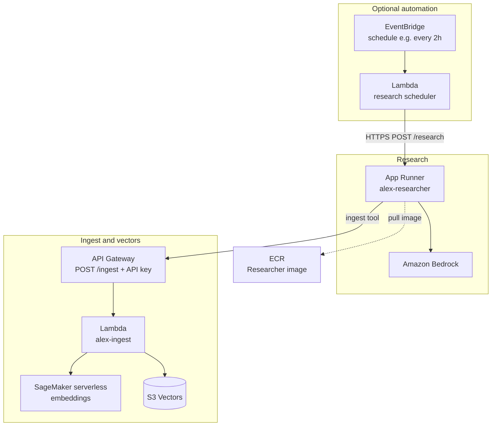
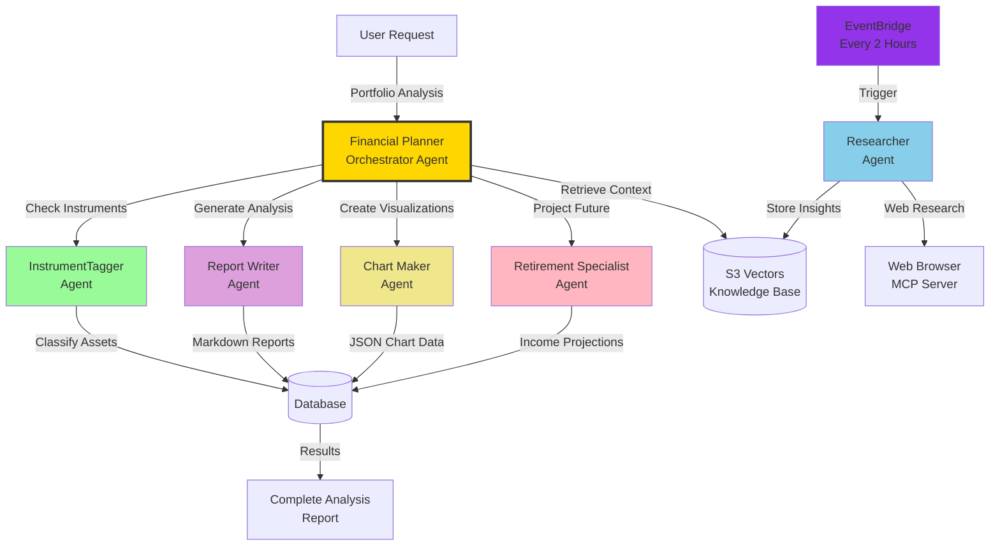

# Alex — Agentic Learning Equities eXplainer

**Alex** is a multi-agent, production-style SaaS financial planning platform: portfolio intelligence, AI-generated research, embeddings-backed knowledge, and a Next.js + Clerk frontend. It is the **Week 3–4 capstone** for the Udemy course **AI in Production** (Ed Donner).


## Summary and purpose

Students deploy Alex on **AWS** end-to-end: serverless compute (Lambda, App Runner), **Amazon Bedrock** for agent reasoning, **SageMaker** for text embeddings, **S3 Vectors** for cost-effective semantic storage, optional **EventBridge** automation, and a **Next.js** UI with **Clerk** auth. The goal is to practice real **IaC (Terraform)**, observability, and multi-agent patterns—not only notebooks.

**What you get out of the repo:** guided Terraform stacks (`terraform/2_sagemaker` … `terraform/8_enterprise`), Python agents under `backend/` (each directory is a **uv** project), a `frontend/` app, and `scripts/` for local dev and deploy helpers.

Deeper narrative for the research → ingest → vectors path: **[docs/data-pipeline.md](docs/data-pipeline.md)**. Full architecture notes (components, costs, flows): **[docs/3_architecture.md](docs/3_architecture.md)**.

## Architecture (high level)

Optional **EventBridge** triggers a small **scheduler Lambda**, which calls **App Runner** running the **Researcher** agent. The agent uses **Bedrock** (and optional **Playwright MCP** for web research), then stores text via **API Gateway** into the **ingest Lambda**, which calls **SageMaker** for embeddings and writes to **S3 Vectors**.



*(Diagram uses generic labels; resource names and regions match what you configure in Terraform and `.env`—see the guides.)*

### Agent collaboration overview

Portfolio analysis in **Guide 6** is orchestrated by the **Financial Planner** Lambda agent, which coordinates specialized agents and writes results to Aurora. The **Researcher** runs on its own schedule and feeds **S3 Vectors**; the planner retrieves that context during analysis. Full detail: **[docs/4_agent_architecture.md](docs/4_agent_architecture.md)**.



## Tech stack

| Area | Technologies |
| --- | --- |
| **Cloud** | AWS Lambda, App Runner, API Gateway, S3 / S3 Vectors, SageMaker (serverless inference), Bedrock, EventBridge Scheduler, ECR, Aurora Serverless v2 (later guides), SQS, CloudFront, etc. |
| **IaC** | Terraform (independent state per `terraform/*` directory) |
| **Agents / API** | Python 3.12+, **uv**, FastAPI (`backend/api`), **OpenAI Agents SDK** + LiteLLM → Bedrock |
| **Frontend** | Next.js (Pages Router), React, TypeScript, Tailwind, **Clerk** |
| **Containers** | Docker (Researcher image build/push) |
| **Course tooling** | AWS CLI, `uv run` for all Python entrypoints |

## Repository layout

| Path | Role |
| --- | --- |
| **[guides/](guides/)** | Start here: ordered steps `1_permissions.md` → `8_enterprise.md` |
| **[backend/](backend/)** | Agents, API, ingest, database library—**each subfolder is a uv project** |
| **[frontend/](frontend/)** | Next.js app; needs `frontend/.env.local` (Clerk) |
| **[terraform/](terraform/)** | One stack per guide phase (`2_sagemaker` … `8_enterprise`) |
| **[scripts/](scripts/)** | Local dev orchestration (`run_local.py`), deploy helpers |
| **[docs/](docs/)** | Extra architecture and pipeline write-ups |

**Suggested order of work:** Week 3 — guides 1 → 2 → 3 → 4. Week 4 — guides 5 → 6 → 7 → 8. Copy each `terraform.tfvars.example` to `terraform.tfvars` before `terraform apply`.

## How to run this project

### Prerequisites

- **uv** ([install](https://docs.astral.sh/uv/)) — all Python in this repo is meant to run with `uv`, not bare `python` / `pip`.
- **Node.js** and **npm** — for the frontend.
- **AWS account + AWS CLI** configured (for deployed stacks and tests that call AWS).
- **Docker Desktop** — when packaging Lambdas with Docker or building the Researcher image (see guides).

### Full local app (API + Next.js)

Used after you have completed the parts of the course that introduce the **FastAPI** backend and **frontend** (see **Guide 7** and root `.env` / Clerk keys).

1. From the repo root, create **`/.env`** with the variables described in the guides (as you progress through Parts 1–7).
2. Create **`frontend/.env.local`** with your **Clerk** publishable key and related vars (see **Guide 7**).
3. Start both services:

```bash
cd scripts
uv sync
uv run run_local.py
```

- Frontend: **http://localhost:3000**  
- Backend: **http://localhost:8000** (OpenAPI: **http://localhost:8000/docs**)  
- Stop with **Ctrl+C**.

### Research / ingest only (without full UI)

Follow **Guides 2–4** in `guides/`: deploy SageMaker, ingest + API Gateway, then App Runner Researcher. Test with commands from those guides, for example:

```bash
cd backend/ingest && uv run test_ingest_s3vectors.py
cd backend/researcher && uv run test_research.py
```

Always use **`uv run …`** inside the relevant `backend/<package>` directory.

### Deploying to AWS

There is no single “deploy everything” button: you apply **Terraform per directory** and run packaging scripts as each **guide** describes. Use **`scripts/deploy.py`** where the course points you at it (e.g. frontend assets). Destroy resources with **`scripts/destroy.py`** or `terraform destroy` per stack when you are done, to control cost—especially **Aurora** (Guide 5).

---

## Order of play

### Week 3

- **Week 3 Day 3** — [1_permissions](guides/1_permissions.md) and [2_sagemaker](guides/2_sagemaker.md)
- **Week 3 Day 4** — [3_ingest](guides/3_ingest.md)
- **Week 3 Day 5** — [4_researcher](guides/4_researcher.md)

### Week 4

- **Week 4 Day 1** — [5_database](guides/5_database.md)
- **Week 4 Day 2** — [6_agents](guides/6_agents.md)
- **Week 4 Day 3** — [7_frontend](guides/7_frontend.md)
- **Week 4 Day 4** — [8_enterprise](guides/8_enterprise.md)

**NOTE**: 
1. Read all [docs](docs) in sequence for understanding. 
2. Follow [guides](guides) for AWS infra setup. 
3. Refer [backend](backend) & [frontend](frontend) code for detailed implementation. 

---

**Reference:** [AI in Production]— capstone Weeks 3–4. For AI-assisted work in this repo, read **`gameplan.md`**, **`CLAUDE.md`**, or **`AGENTS.md`** (they point at the same project briefing).
