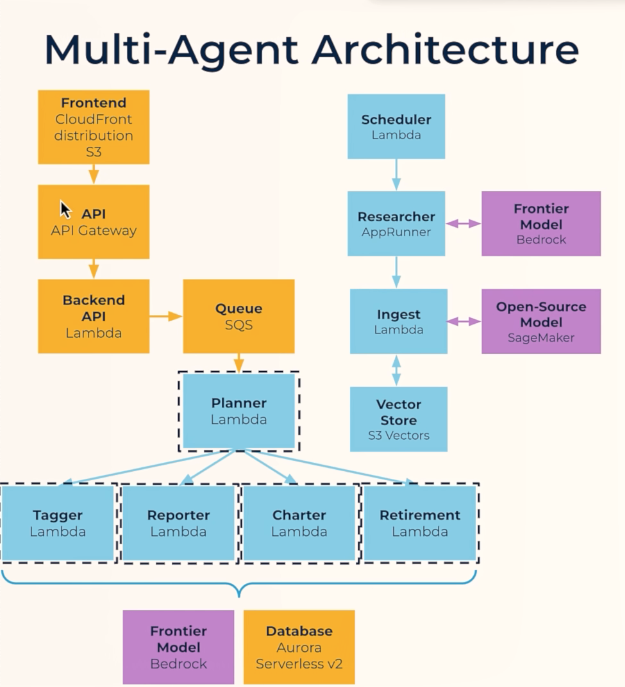
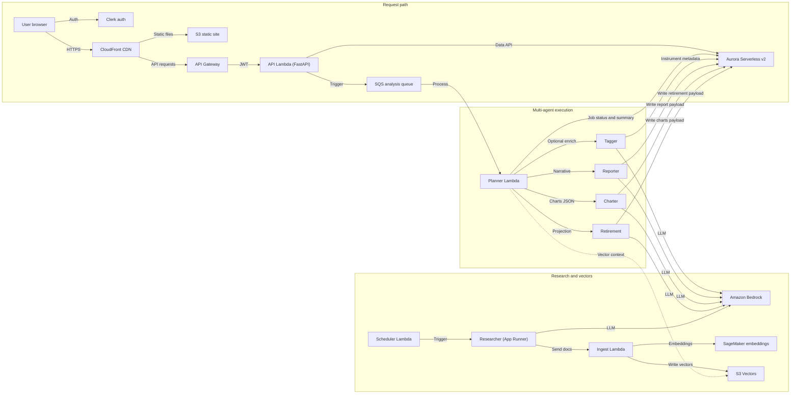
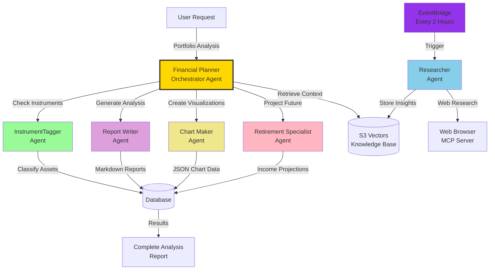

# Alex — Agentic Learning Equities eXplainer

**Alex** is a multi-agent, production-style SaaS financial planning platform: portfolio intelligence, AI-generated research, embeddings-backed knowledge, and a Next.js + Clerk frontend.

## Summary and purpose

Deploy Alex on **AWS** end-to-end: serverless compute (Lambda, App Runner), **Amazon Bedrock** for agent reasoning, **SageMaker** for text embeddings, **S3 Vectors** for cost-effective semantic storage, optional **EventBridge** automation, and a **Next.js** UI with **Clerk** auth. The goal is to practice real **IaC (Terraform)**, observability, and multi-agent patterns—not only notebooks.

**What you get out of the repo:** guided Terraform stacks (`terraform/2_sagemaker` … `terraform/8_enterprise`), Python agents under `backend/` (each directory is a **uv** project), a `frontend/` app, **`aws/`** for one-command full-stack deploy/destroy on AWS, and `scripts/` for local dev and Guide 7–scoped helpers.

Deeper narrative for the research → ingest → vectors path: **[docs/data-pipeline.md](docs/data-pipeline.md)**. Full architecture notes (components, costs, flows): **[docs/3_architecture.md](docs/3_architecture.md)**.

## Architecture (high level)

### Complete multi-agent AWS architecture

Alex splits into three cooperating planes: the **user request path** (static UI and API into a queue), the **agent orchestra** (planner plus four specialist Lambdas on Bedrock and Aurora), and the **research and vector pipeline** (scheduled Researcher on App Runner, ingest, SageMaker embeddings, and S3 Vectors). The reference diagram below matches the course “multi-agent” view; more narrative and cost notes live in **[docs/3_architecture.md](docs/3_architecture.md)**.



**Request ingestion (user-facing):** **CloudFront** serves the **Next.js** frontend from **S3**. **API Gateway** fronts the **FastAPI** **Lambda** (Guide 7). That Lambda uses **Aurora** for portfolio state and publishes agent jobs to **SQS** for asynchronous processing.

**Planning and agent execution (Guide 6):** The **Planner** Lambda consumes **SQS** and coordinates the **Tagger**, **Reporter**, **Charter**, and **Retirement** Lambdas. Each agent calls a **frontier model on Amazon Bedrock** and reads or writes structured outputs in **Aurora Serverless v2**.

**Background research and knowledge (Guides 3–4):** An **EventBridge**-driven **scheduler Lambda** can invoke the **Researcher** on **App Runner**, which also uses **Bedrock** (and optional web research). The Researcher pushes text through **API Gateway** into the **ingest Lambda**, which calls **SageMaker** for embeddings and writes vectors to **S3 Vectors** so the planner and agents can retrieve research context during portfolio analysis.



The “Guide 7 zoom-in” diagram (frontend + API + agent wiring) now lives in **[`docs/03_researcher_architecture.md`](docs/03_researcher_architecture.md)** to keep the README focused.


### Agent collaboration overview

Portfolio analysis in **Guide 6** is orchestrated by the **Financial Planner** Lambda agent, which coordinates specialized agents and writes results to Aurora. The **Researcher** runs on its own schedule and feeds **S3 Vectors**; the planner retrieves that context during analysis. Full detail: **[docs/4_agent_architecture.md](docs/4_agent_architecture.md)**.



The detailed **researcher + ingest + vectors** diagram now lives in **[`docs/03_researcher_architecture.md`](docs/03_researcher_architecture.md)** to keep the README focused.

## Tech stack

| Area | Technologies |
| --- | --- |
| **Cloud** | AWS Lambda, App Runner, API Gateway, S3 / S3 Vectors, SageMaker (serverless inference), Bedrock, EventBridge Scheduler, ECR, Aurora Serverless v2 (later guides), SQS, CloudFront, etc. |
| **IaC** | Terraform (independent state per `terraform/*` directory) |
| **Agents / API** | Python 3.12+, **uv**, FastAPI (`backend/api`), **OpenAI Agents SDK** + LiteLLM → Bedrock |
| **Frontend** | Next.js (Pages Router), React, TypeScript, Tailwind, **Clerk** |
| **Containers** | Docker (Researcher image build/push) |
| **Course tooling** | AWS CLI, `uv run` for all Python entrypoints |

## Repository layout

| Path | Role |
| --- | --- |
| **[guides/](guides/)** | Start here: ordered steps `1_permissions.md` → `8_enterprise.md` |
| **[backend/](backend/)** | Agents, API, ingest, database library—**each subfolder is a uv project** |
| **[frontend/](frontend/)** | Next.js app; needs `frontend/.env.local` (Clerk) |
| **[terraform/](terraform/)** | One stack per guide phase (`2_sagemaker` … `8_enterprise`) |
| **[scripts/](scripts/)** | Local dev (`run_local.py`); **Guide 7 only** — `deploy.py` / `destroy.py` for frontend + API |
| **[aws/](aws/)** | **Full-stack** AWS orchestration: `deploy_all_aws.py`, `destroy_all_aws.py`, validate scripts — see **[aws/README.md](aws/README.md)** |
| **[docs/](docs/)** | Extra architecture and pipeline write-ups (including **[docs/6_aws-deployment.md](docs/6_aws-deployment.md)** for stack order) |

**Suggested order of work:** Week 3 — guides 1 → 2 → 3 → 4. Week 4 — guides 5 → 6 → 7 → 8. Copy each `terraform.tfvars.example` to `terraform.tfvars` before `terraform apply`. Once prerequisites are satisfied, you may run the full sequence via **`aws/deploy_all_aws.py`** instead of applying each stack by hand (see **Deploying to AWS** below).

## How to run this project

### Prerequisites

- **uv** ([install](https://docs.astral.sh/uv/)) — all Python in this repo is meant to run with `uv`, not bare `python` / `pip`.
- **Node.js** and **npm** — for the frontend.
- **AWS account + AWS CLI** configured (for deployed stacks and tests that call AWS).
- **Docker Desktop** — when packaging Lambdas with Docker or building the Researcher image (see guides).

### Full local app (API + Next.js)

Used after you have completed the parts of the course that introduce the **FastAPI** backend and **frontend** (see **Guide 7** and root `.env` / Clerk keys).

1. From the repo root, create **`/.env`** with the variables described in the guides (as you progress through Parts 1–7).
2. Create **`frontend/.env.local`** with your **Clerk** publishable key and related vars (see **Guide 7**).
3. Start both services:

```bash
cd scripts
uv sync
uv run run_local.py
```

- Frontend: **http://localhost:3000**  
- Backend: **http://localhost:8000** (OpenAPI: **http://localhost:8000/docs**)  
- Stop with **Ctrl+C**.

### Research / ingest only (without full UI)

Follow **Guides 2–4** in `guides/`: deploy SageMaker, ingest + API Gateway, then App Runner Researcher. Test with commands from those guides, for example:

```bash
cd backend/ingest && uv run test_ingest_s3vectors.py
cd backend/researcher && uv run test_research.py
```

Always use **`uv run …`** inside the relevant `backend/<package>` directory.

### Cloud deployment (`aws/` orchestration)

After you have **AWS CLI**, **Terraform**, **Docker**, **uv**, **npm**, and the **per-guide** files in place (`terraform/*/terraform.tfvars`, root **`.env`**, Clerk vars for Part 7, S3 **Vector** bucket + index in the console per Guide 3), you can drive the **full stack** from the **`aws/`** uv project.

From the repo root. Quick commands/scripts:

```bash
cd aws && uv sync

# Deploy
uv run python deploy_all_aws.py --sleep 20   # Takes ~30 mins for full deployment. Needs Wired Connection
uv run python validate_deploy_aws.py

# Destroy
uv run python destroy_all_aws.py --yes # Takes ~15 mins for full destroy.
uv run python validate_destroy_aws.py
```

| Goal | One-liner (from repo root, after `cd aws && uv sync`) |
| --- | --- |
| **Deploy everything** (SageMaker → … → optional enterprise; Part 7 runs `scripts/deploy.py` inside the flow) | `uv run python deploy_all_aws.py` |
| **Destroy Terraform stacks** (safe order; see `aws/README.md` for `4_researcher` pause vs full destroy) | `uv run python destroy_all_aws.py --yes` |
| **Dry-run** (list steps / stacks only) | `uv run python deploy_all_aws.py --dry-run` or `uv run python destroy_all_aws.py --dry-run` |

**Details, every CLI flag, partial runs, and caveats** (S3 Vectors pause, `--skip-vectors-prompt`, `--from-step`, `4_researcher` / App Runner, cost notes): **[aws/README.md](aws/README.md)**. **Per-stack Terraform explainer:** each `terraform/<stack>/INFRA.md`. **Master checklist and stack order:** **[docs/6_aws-deployment.md](docs/6_aws-deployment.md)**.

**Still manual:** S3 **Vector** buckets and indexes (Guide 3) are not deleted by `destroy_all_aws.py` — remove them in the AWS console if you want that cost gone.

You can always follow the **guides** step-by-step with `terraform apply` per directory instead; `scripts/deploy.py` / `scripts/destroy.py` remain **Guide 7 only** (frontend + API + S3 upload), which `deploy_all_aws.py` invokes as the **`part7`** step.

---

**Reference:** 

1. Read all [docs](docs) in sequence for understanding. 
2. Follow [guides](guides) for AWS infra setup. 
3. Refer [backend](backend) & [frontend](frontend) code for detailed implementation.

###### Focus: 

- AWS Services used.
- MLOPS - Terraform for Infra + Deployment scripts. 
- Frontend development using Nodejs and React.
- Full-stack development.
- AI stack with AWS BedRock & SageMaker. MCP Server.
- Refer [Notes](https://github.com/aditya-caltechie/ai-tutorial-notes/tree/main/mlops)
