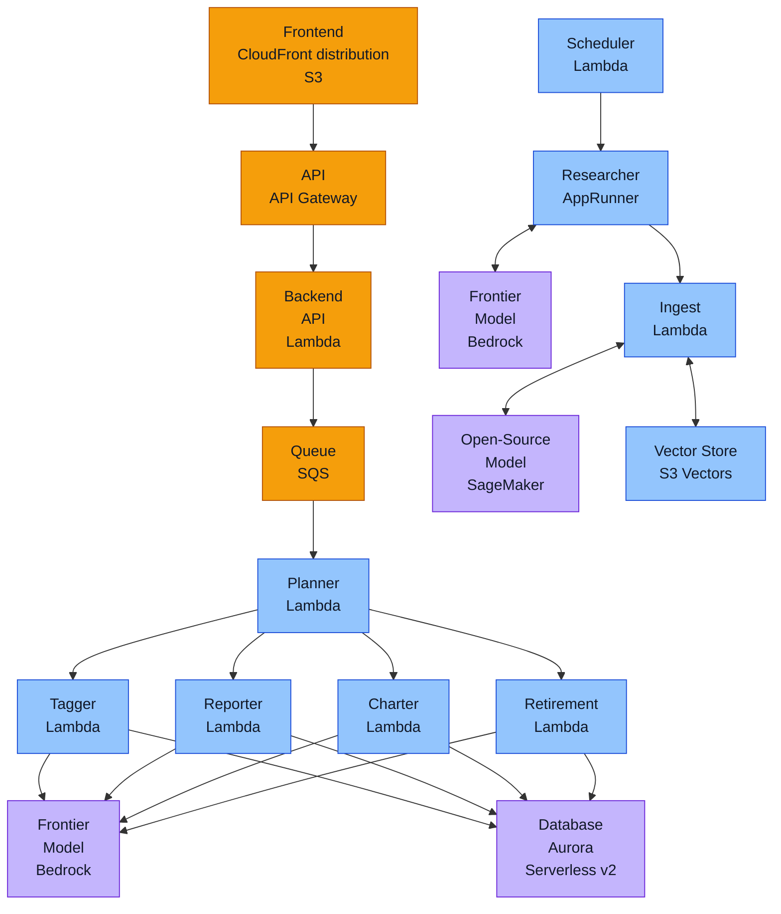
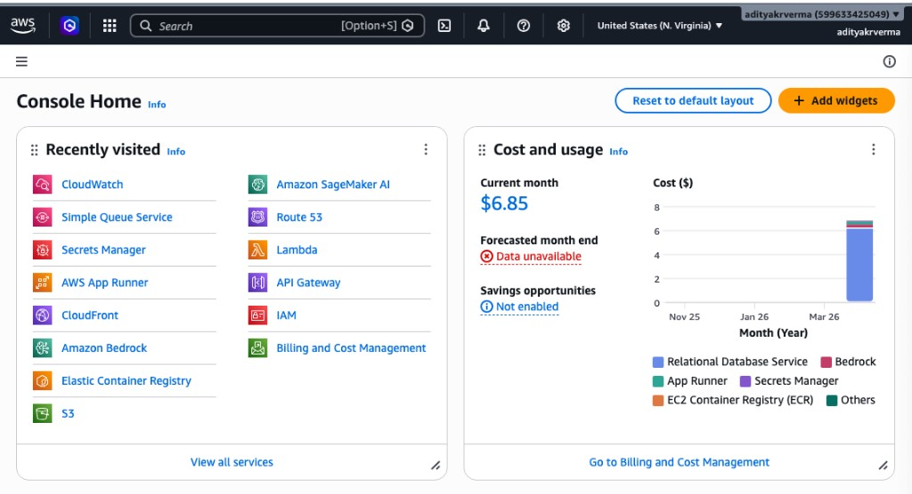

# AWS orchestration (`aws/`)

Full-stack automation for Alex lives here and in [`docs/6_aws-deployment.md`](../docs/6_aws-deployment.md).

---

## What was added: `aws/` orchestration

| File | Purpose |
| --- | --- |
| [`deploy_all_aws.py`](deploy_all_aws.py) | End-to-end **deploy** aligned with `docs/6_aws-deployment.md`: Terraform **2 → 8_enterprise** (by steps), `uv run` for ingest / researcher / DB / agents, then **`scripts/deploy.py`** for **Guide 7** (step id `part7`). Prints each command and **`terraform output -json`** after each apply. **`--sleep`** (default **15s**) between most steps. |
| [`destroy_all_aws.py`](destroy_all_aws.py) | End-to-end **destroy** for stacks **`8_enterprise` → `2_sagemaker`**, with **`--sleep`** (default **5s**). Empties the Part 7 frontend bucket before destroying `7_frontend`. **`4_researcher`**: pauses App Runner, skips Terraform destroy unless **`--destroy-researcher-terraform`**. Requires **`--yes`**. |
| [`validate_deploy_aws.py`](validate_deploy_aws.py) | **Read-only checks after deploy**: Terraform outputs + `aws` CLI (resources **present**). Optional stack **`8_enterprise`** is **SKIP** if not deployed. |
| [`validate_destroy_aws.py`](validate_destroy_aws.py) | **Read-only checks after destroy**: expects Alex-named resources to be **absent** in AWS (inverse of `validate_deploy_aws.py`). Does not cover S3 Vector console buckets. |
| [`deploy_all_aws.md`](deploy_all_aws.md) | Step-by-step explanation of what `deploy_all_aws.py` deploys (Terraform vs packaging/manual), plus tables and ASCII flow. |
| [`destroy_all_aws.md`](destroy_all_aws.md) | Step-by-step explanation of what `destroy_all_aws.py` destroys (order, bucket emptying, skip rules), plus tables and ASCII flow. |
| [`orchestrator.py`](orchestrator.py) | Shared `terraform init` / `apply` / `destroy`, output printing, S3 empty helper. |
| [`pyproject.toml`](pyproject.toml) + [`uv.lock`](uv.lock) | Small **uv** project so you run everything with **`uv run`** from `aws/`. |
| This **README** | How to run + comparison tables. |

---

## Architecture diagram (crisp)

This is the same multi-agent architecture as the course diagram, but rendered as text so it stays sharp in Markdown.



ASCII fallback (if your Markdown viewer doesn’t render Mermaid):

```text
Frontend (CloudFront/S3) -> API Gateway -> Backend API (Lambda) -> SQS -> Planner (Lambda)
                                                         |
                                                         +-> Tagger (Lambda) ----\
                                                         +-> Reporter (Lambda) ---+-> Bedrock (Frontier Model)
                                                         +-> Charter (Lambda) ----/
                                                         +-> Retirement (Lambda) -/
                                                         |
                                                         +-> Aurora (Database, Serverless v2)

Scheduler (Lambda) -> Researcher (AppRunner) <-> Bedrock (Frontier Model)
                         |
                         v
                     Ingest (Lambda) <-> Vector Store (S3 Vectors)
                         ^
                         |
          SageMaker (Open-Source Embedding Model)
```

## Commands

From this directory:

```bash
cd aws && uv sync

uv run python deploy_all_aws.py --help
uv run python deploy_all_aws.py --sleep 20
uv run python deploy_all_aws.py --skip-vectors-prompt --sleep 20

uv run python destroy_all_aws.py --dry-run
uv run python destroy_all_aws.py --yes

uv run python validate_deploy_aws.py
uv run python validate_deploy_aws.py --fail-fast

uv run python validate_destroy_aws.py
uv run python validate_destroy_aws.py --fail-fast
```

**Part 7** (frontend + API + upload) is still implemented in **`scripts/deploy.py`**; `deploy_all_aws.py` invokes it as step **`part7`** (Guide 7 in the course tables).

---

## Troubleshooting

### Analysis is “stuck” (UI shows `pending` forever)

**Symptoms**
- In the UI (e.g. `/advisor-team`), the job status stays **`pending`** and never progresses.

**Most common cause**
- The **Planner** Lambda is failing immediately with an Aurora secret permission error because **`terraform/5_database` was re-deployed** and created a **new** Secrets Manager ARN (random suffix), but **`terraform/6_agents` is still configured with the old `aurora_secret_arn`**.
- In CloudWatch logs (`/aws/lambda/alex-planner`) you’ll typically see something like:
  - `AccessDeniedException ... is not authorized to perform: secretsmanager:GetSecretValue on resource ...`

**Fix**
- **Preferred (automatic)**: re-run the deploy pipeline step that applies `terraform/6_agents` (it syncs to the latest Part 5 outputs):

```bash
cd aws
uv run python deploy_all_aws.py --from-step agents --to-step agents
```

- **Manual**: update `terraform/6_agents/terraform.tfvars` with the latest Part 5 outputs and apply:

```bash
cd terraform/5_database
terraform output -raw aurora_secret_arn

cd ../6_agents
# paste the new value into terraform.tfvars (aurora_secret_arn)
terraform apply
```

---

## After `deploy_all_aws.py` — what you should see

When the sequence includes **`part7`** (runs `scripts/deploy.py`), **`terraform/7_frontend`** outputs include:

| Output | Meaning |
| --- | --- |
| **`cloudfront_url`** | **Public Alex app** — `https://….cloudfront.net` (Next.js static site + `/api/*` routed to API Gateway). Open this in a browser. |
| **`api_gateway_url`** | Direct HTTP API URL (the UI normally talks to **`/api/*` on CloudFront**, not this host directly). |
| **`s3_bucket_name`** | Bucket holding the exported `frontend/out/` files. |

**Expect:** Clerk sign-in, then dashboard / accounts / advisor flows per [`guides/7_frontend.md`](../guides/7_frontend.md). CloudFront can take **several minutes** after first creation. **`deploy_all_aws.py`** prints a short **“what to expect”** block at the end when `part7` ran.

You still need the **S3 Vectors** bucket (Guide 3) before ingest/agents can use vectors; `validate_deploy_aws.py` reminds you about vectors.

---

## If deploy fails part-way — continue from where it failed

`deploy_all_aws.py` is designed for **re-runs**. If it fails in the middle, you can usually continue by selecting a later range with **`--from-step`** / **`--to-step`**.

Example: if you have already applied **Aurora** (step id **`database`**) but the run failed during **schema/seed** (**`db-migrate`**), you can resume from there:

```bash
cd aws
uv run python deploy_all_aws.py --from-step db-migrate --to-step enterprise
```

Or stop earlier if you don’t want the UI yet (examples):

```bash
cd aws
uv run python deploy_all_aws.py --from-step db-migrate --to-step agents
cd aws
uv run python deploy_all_aws.py --from-step agents --to-step part7
```

To confirm the exact step ids and order **without deploying anything**, use:

```bash
cd aws
uv run python deploy_all_aws.py --dry-run
```

---

## CLI reference (all flags)

Every script supports **`-h`** / **`--help`** for the full argparse text (e.g. `uv run python deploy_all_aws.py --help`).

### `--fail-fast` (validate scripts only)

**`validate_deploy_aws.py`** and **`validate_destroy_aws.py`** run a **list of checks** in order. By default they run **all** checks and then exit **non-zero** if any check failed.

With **`--fail-fast`**, the script **stops immediately** on the first failing check (first **`FAIL`** for deploy validation, or first **`STILL_PRESENT`** for destroy validation) and exits with code **1**. Use it when you only care whether anything is wrong, not a full report of every line.

---

### `deploy_all_aws.py`

| Flag | Meaning |
| --- | --- |
| **`--from-step`** `STEP` | First step to run. **`STEP`** is one of: `sagemaker`, `vectors`, `ingest`, `researcher-partial`, `researcher-image`, `researcher-full`, `database`, `db-migrate`, `agents`, `part7`, `enterprise`. Default: **`sagemaker`**. |
| **`--to-step`** `STEP` | Last step to run (same choices as `--from-step`). Default: **`enterprise`**. |
| **`--sleep`** `SEC` | Seconds to wait after each heavy step (Terraform apply and similar). Default: **`15`**. Use **`0`** to disable. |
| **`--skip-vectors-prompt`** | Do not pause for **Enter** on the Guide 3 S3 Vectors console step; use when the vector bucket + index already exist. |
| **`--run-8b`** | After the **`agents`** step, run **`deploy_all_lambdas.py`** in `backend/` (optional Lambda refresh per Guide 6). Only applies if **`agents`** is in the selected step range. |
| **`--dry-run`** | Print the step ids that **would** run (and whether **8b** would run), then exit **without** calling Terraform or AWS. |

**`--from-step`** must not be after **`--to-step`** in the pipeline order (script exits with code 2).

---

### `destroy_all_aws.py`

| Flag | Meaning |
| --- | --- |
| **`--yes`** | **Required** for a real destroy (safety gate). Without it, the script refuses to run. |
| **`--from-stack`** `ID` | First Terraform directory in teardown order. **`ID`**: `8_enterprise`, `7_frontend`, `6_agents`, `5_database`, `4_researcher`, `3_ingestion`, `2_sagemaker`. Default: **`8_enterprise`**. |
| **`--to-stack`** `ID` | Last stack in the same list. Default: **`2_sagemaker`**. Lets you destroy only part of the chain (e.g. **`--from-stack`** / **`--to-stack`** both **`7_frontend`**). |
| **`--sleep`** `SEC` | Pause between stack destroys. Default: **`5`**. Use **`0`** to disable. |
| **`--dry-run`** | Print the stack ids that **would** be destroyed, then exit. Does **not** require **`--yes`**. |
| **`--destroy-researcher-terraform`** | For **`4_researcher`**, run **`terraform destroy`** (removes App Runner, ECR, scheduler, etc.). **Default:** skip Terraform destroy there and only run **`aws apprunner pause-service`** when possible. |

**`--from-stack`** must be **earlier** in the fixed order than **`--to-stack`** (same as the table: 8 → 7 → … → 2).

---

### `validate_deploy_aws.py`

| Flag | Meaning |
| --- | --- |
| **`--fail-fast`** | Stop on the first **`FAIL`** instead of listing every check. |

Read-only: Terraform state outputs on disk + **`aws`** CLI. Does not modify AWS.

---

### `validate_destroy_aws.py`

| Flag | Meaning |
| --- | --- |
| **`--fail-fast`** | Stop on the first **`STILL_PRESENT`** (resource still found in AWS) instead of listing every check. |
| **`--region`** `NAME` | AWS region for all CLI calls (e.g. **`us-east-1`**). Default: your profile’s **`AWS_REGION`** / **`AWS_DEFAULT_REGION`** / config default. Use if you deployed in a non-default region. |

Read-only: **`aws`** CLI only (plus informational reads of local **`terraform.tfstate`**). Does not modify AWS.

---

## Related doc

| Doc | Content |
| --- | --- |
| [`docs/6_aws-deployment.md`](../docs/6_aws-deployment.md) | Master tables, dependency order, manual console steps, and how `aws/` relates to `scripts/`. |

---

FYI: 
## `scripts/` — Guide 7 only

**No.** In `scripts/` you only have **Guide 7–scoped** helpers. They **do not** deploy or destroy SageMaker, ingest, researcher, database, agents, or enterprise stacks.

| Script | Role | Same as full deploy/teardown? |
| --- | --- | --- |
| [`scripts/deploy.py`](../scripts/deploy.py) | Packages `backend/api`, runs `terraform/7_frontend`, builds Next.js, uploads `frontend/out/` to S3, invalidates CloudFront. | **No** — only **Part 7** (frontend + API). |
| [`scripts/destroy.py`](../scripts/destroy.py) | Empties the Part 7 frontend S3 bucket, runs `terraform destroy` in `terraform/7_frontend`, removes some local build artifacts. | **No** — only **Part 7** teardown. |

---

### AWS credentials (root user, IAM user, or SSO)

`deploy_all_aws.py`, `destroy_all_aws.py`, `validate_deploy_aws.py`, and `validate_destroy_aws.py` only require a working **`aws` CLI** profile (or environment variables) the same way manual `terraform apply` / `terraform destroy` would. They do **not** create or assume a course IAM user, and they do **not** read Guide 1.

If you use the **account root user** for access keys or console-only work, Terraform and these scripts behave the same as with any other principal: whatever passes `aws sts get-caller-identity` is what AWS bills and authorizes. **[Guide 1](../guides/1_permissions.md) (AlexAccess group, etc.) is optional** in that case, because root already has full account access. AWS recommends moving to a **least-privilege IAM user or role** for day-to-day use once you leave a tight learning sandbox.

At startup, `check_tools()` prints **`aws sts get-caller-identity`** when it succeeds so you can confirm which identity is running deploy or destroy.

### After destroy — did AWS really go quiet?

**`validate_deploy_aws.py`** checks that resources **exist** (post-deploy validation). It is the wrong tool right after **`destroy_all_aws.py`**.

Use **`validate_destroy_aws.py`** instead: read-only `aws` CLI checks that named Alex resources (Lambdas, SQS, Aurora, SageMaker endpoint, S3 buckets, ECR, App Runner, API Gateway, CloudFront, EventBridge, CloudWatch dashboards) are **gone** in your default region. It does **not** inspect S3 **Vector** buckets (console-only); the script prints the same reminder as destroy.

```bash
cd aws && uv run python validate_destroy_aws.py
cd aws && uv run python validate_destroy_aws.py --region eu-west-1   # if you deployed there
```

For billing truth, still open **AWS Billing / Cost Explorer** after a day — some charges lag.

---

**One command** (`deploy_all_aws.py`) runs the **full automated sequence** (Terraform **2 → 8**, packaging, DB migrations, then `scripts/deploy.py` for Part 7) with **logged** commands and **`terraform output`** after each apply.

Terraform **cannot** create **S3 Vector** buckets (Guide 3); the script **pauses** there so you can confirm console work—or pass **`--skip-vectors-prompt`** if the vector bucket + index **already exist**. **`destroy_all_aws.py --yes`** tears down Terraform stacks in safe order except **`4_researcher`**: by default it **pauses** the Researcher **App Runner** service and **skips** `terraform destroy` there (use **`--destroy-researcher-terraform`** to remove that stack). S3 Vector buckets are still manual.

---

## S3 Vectors (manual in AWS) — what the deploy script does

**You must create the S3 *Vector* bucket and index yourself** in the AWS Console. This repo’s Terraform does **not** provision vector buckets (they live under S3 → **Vector buckets**, not a normal S3 bucket).

When `deploy_all_aws.py` reaches the **`vectors`** step, it will:

1. **Print** that you need the console and point you at **[`guides/3_ingest.md`](../guides/3_ingest.md)** (same steps as the guide: create vector bucket, create index, naming like `alex-vectors-<account-id>`, index `financial-research`, dimension **384**, metric **Cosine**, etc.).
2. **Remind** you to put **`VECTOR_BUCKET`** (and related values) in the root **`.env`** and in **`terraform/6_agents/terraform.tfvars`** as the guide describes before later steps need them.
3. **Wait** in the terminal until you press **Enter** (that is your “continue”: there is no separate UI button—it is normal stdin after you finish in the browser).

After you press **Enter**, the script moves on to **ingest** (package + `terraform/3_ingestion`).

**Re-runs / automation:** If the vector bucket and index **already exist**, start deploy with **`--skip-vectors-prompt`** so the script does **not** wait for Enter on that step.

---

List of all AWS services used:

### AWS Console (quick visual inventory)



### Services used (what, where, when)

This table maps the **architecture diagram** above to concrete services, and points at the **repo locations** where you’ll see each service referenced.

| Service | Where it shows up (architecture) | Where in this repo (examples) | When/why it’s used |
|---|---|---|---|
| **Amazon CloudFront** | Frontend CDN in front of S3 static site | `terraform/7_frontend/` (CloudFront + origin routing) | Serves the Next.js static export globally; routes `/api/*` to API Gateway. |
| **Amazon S3** (static site) | Frontend origin (static Next.js output) | `frontend/out/` produced by deploy; `scripts/deploy.py`; `terraform/7_frontend/` | Hosts the frontend build artifacts; CloudFront reads from it. |
| **Amazon API Gateway** | Edge API entrypoint | `terraform/7_frontend/` (API Gateway); `backend/api/main.py` routes are exposed as `/api/*` | Terminates HTTP and forwards to the API Lambda; throttling and CORS live here. |
| **AWS Lambda** (API) | Backend API | `backend/api/main.py` | FastAPI service that handles user CRUD + starts analysis jobs; called by the frontend. |
| **Amazon SQS** | Queue between API and Planner | `backend/api/main.py` (enqueue to `SQS_QUEUE_URL`); `backend/planner/lambda_handler.py` (SQS-triggered handler) | Buffers long-running work so the UI stays responsive; enables retries/DLQ/backpressure. See `docs/09_production-readiness.md` for the enterprise rationale (buffering, visibility timeout, DLQ, idempotency). |
| **AWS Lambda** (Planner) | Orchestrator | `backend/planner/lambda_handler.py`, `backend/planner/agent.py` | SQS consumer. Updates job status, then invokes specialist Lambdas (tagger/reporter/charter/retirement). |
| **AWS Lambda** (Tagger) | Specialist agent | `backend/tagger/` | Classifies instruments when allocations are missing; writes results to DB. |
| **AWS Lambda** (Reporter) | Specialist agent (RAG + narrative) | `backend/reporter/lambda_handler.py`, `backend/reporter/agent.py` | Generates the report narrative; uses the S3 Vectors knowledge base via `get_market_insights`; stores report in Aurora. |
| **AWS Lambda** (Charter) | Specialist agent (structured outputs) | `backend/charter/lambda_handler.py` | Generates chart JSON payloads; validates/parses JSON and stores results in Aurora. |
| **AWS Lambda** (Retirement) | Specialist agent | `backend/retirement/` | Builds retirement projections; stores results in Aurora. |
| **Amazon Aurora Serverless v2** (PostgreSQL) | Shared DB for state + results | `terraform/5_database/`; `backend/database/` and `backend/*/src/Database` usage | Primary system-of-record: users/accounts/positions/jobs plus agent outputs and job state transitions. |
| **AWS Secrets Manager** | DB credentials (and other secrets) | `terraform/5_database/` outputs; consumed via env vars in agent Lambdas; referenced in `aws/README.md` troubleshooting (Part 5 re-deploy creates new ARN) | Keeps credentials out of code; Lambdas fetch DB secret at runtime. See `docs/09_production-readiness.md` for “no creds in code” and rotation considerations. |
| **Amazon Bedrock** | LLM inference for agents | Agent code uses LiteLLM Bedrock models (e.g., `LitellmModel(model=f\"bedrock/{model_id}\")`) across `backend/planner/`, `backend/reporter/`, `backend/charter/`, `backend/retirement/`, `backend/tagger/` | Runs the “frontier” models for agent reasoning and generation. |
| **Amazon SageMaker** | Embeddings endpoint | `terraform/2_sagemaker/`; embed calls in `backend/ingest/search_s3vectors.py` and `backend/reporter/agent.py` | Produces embeddings used to query S3 Vectors (and for ingest). |
| **S3 Vectors** | Vector store | `backend/ingest/ingest_s3vectors.py`, `backend/ingest/search_s3vectors.py`, `backend/reporter/agent.py` | Stores and retrieves private knowledge chunks; used by reporter RAG tool to ground analysis. |
| **AWS App Runner** | Researcher service | `terraform/4_researcher/`; `backend/researcher/server.py` | Hosts the autonomous “Researcher” web service (with optional scheduling); can browse web via MCP and ingest documents. |
| **Amazon ECR** | Container registry for Researcher | `terraform/4_researcher/`; `backend/researcher/deploy.py` | Stores the Researcher container image used by App Runner. |
| **Amazon EventBridge** (Scheduler) | Scheduled research lane | `terraform/4_researcher/` (optional schedule); diagram node “Scheduler Lambda” | Triggers periodic research runs (optional); useful for background knowledge refresh. |
| **Amazon CloudWatch** | Logs, metrics, dashboards/alarms | All Lambdas log here; enterprise dashboards in `terraform/8_enterprise/` | Debugging + operational monitoring (errors, throttles, durations, queue depth/age, DB metrics). |
| **AWS IAM** | Permissions for everything | Terraform IAM roles/policies in each stack | Least-privilege execution roles for Lambdas/App Runner and access to RDS Data API, SQS, Secrets, logs, etc. |

