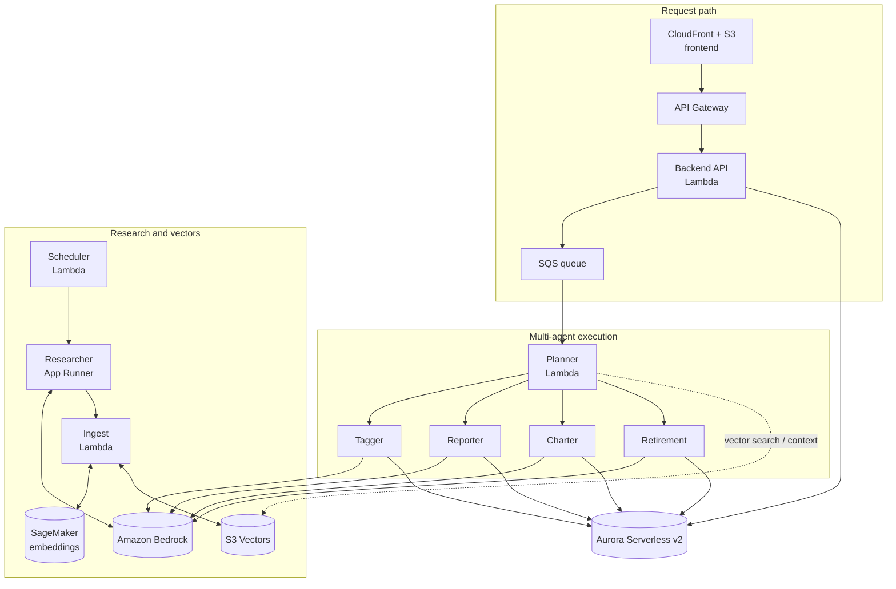
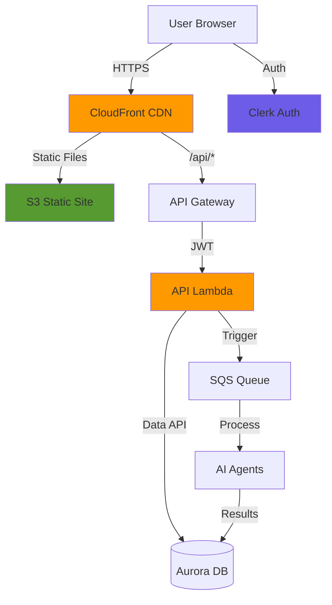

## CloudWatch logs — how to debug end-to-end flow

This doc shows **where to look in CloudWatch** and what a **full UI → API → DB/SQS → Lambdas → DB → UI** lifecycle looks like, with real log snippets (redacted) from a successful run.

---

## Quick index: what to open in CloudWatch

### Lambda log groups (core)

- **API (FastAPI on Lambda)**: `/aws/lambda/alex-api`
- **Planner (orchestrator)**: `/aws/lambda/alex-planner`
- **Specialists**:
  - `/aws/lambda/alex-reporter`
  - `/aws/lambda/alex-charter`
  - `/aws/lambda/alex-retirement`
  - `/aws/lambda/alex-tagger` (only runs when needed)
- **Ingest**: `/aws/lambda/alex-ingest` (Guide 3 ingestion pipeline)

### App Runner (Researcher)

App Runner writes to log groups like:

- `/aws/apprunner/alex-researcher/<service-id>/service`
- `/aws/apprunner/alex-researcher/<service-id>/application`

---

## The one command you’ll use most

If you want a streaming view of the newest logs:

```bash
# Tip: if your environment sets HTTP(S)_PROXY to localhost, clear it:
HTTP_PROXY= HTTPS_PROXY= NO_PROXY= aws logs tail /aws/lambda/alex-planner --since 30m --format short
```

Repeat that for each log group you care about (`alex-api`, `alex-reporter`, etc.).

---

## How the UI flows map to AWS services

### Common “always happens” requests

Most tabs/pages do some combination of:

- **Sync user**: `GET /api/user`
- **Load accounts**: `GET /api/accounts`
- **List jobs**: `GET /api/jobs`
- **Get a specific job**: `GET /api/jobs/{job_id}`

These hit **CloudFront** → `/api/*` → **API Gateway** → **`alex-api` Lambda**, which reads/writes **Aurora (Data API)**.

### “Start analysis” (Advisor Team)

This is the only UI action that kicks off the async pipeline:

1. UI calls `POST /api/analyze`
2. `alex-api` creates a **job row in Aurora** and sends a message to **SQS**
3. SQS triggers **`alex-planner`**
4. Planner:
   - updates job status in Aurora (`pending` → `running`)
   - optionally invokes `alex-tagger`
   - invokes `alex-reporter`, `alex-charter`, `alex-retirement`
   - writes results back to Aurora
5. UI polls `GET /api/jobs/{job_id}` (or `GET /api/jobs`) until it sees completed results

---

## Proof from logs: a full successful portfolio analysis run

Below is a single end-to-end run for job:

- `job_id`: `8518078c-c90c-4a5f-9757-332e56f774ff`

### 1) Planner picks up the SQS message

From `/aws/lambda/alex-planner`:

```text
2026-04-25T21:44:12 [INFO] Planner Lambda invoked with event: {"Records": [{"messageId": "...", ...}]}
2026-04-25T21:44:12 [INFO] Planner: Starting orchestration for job 8518078c-c90c-4a5f-9757-332e56f774ff
```

### 2) Planner checks if Tagger is needed (and skips it here)

From `/aws/lambda/alex-planner`:

```text
2026-04-25T21:44:12 [INFO] Planner: Checking for instruments missing allocation data...
2026-04-25T21:44:13 [INFO] Planner: All instruments have allocation data
```

This is why you may see **no `alex-tagger` logs** for some runs.

### 3) Planner updates market prices (Polygon) before analysis

From `/aws/lambda/alex-planner`:

```text
2026-04-25T21:44:13 [INFO] Market: Fetching prices for 13 symbols: {'BND','SPY','GLD',...}
2026-04-25T21:44:13 Was not able to use the polygon API ... "Unknown API Key"; using a random number
2026-04-25T21:44:15 [INFO] Market: Price update complete
```

If you haven’t set a real Polygon key yet, you’ll still get results, but prices may be placeholder/random.

### 4) Planner calls Bedrock (Nova Pro) for orchestration decisions

From `/aws/lambda/alex-planner`:

```text
LiteLLM completion() model= us.amazon.nova-pro-v1:0; provider = bedrock
```

### 5) Planner invokes the specialist Lambdas

From `/aws/lambda/alex-planner`:

```text
2026-04-25T21:44:17 [INFO] Invoking Reporter Lambda: alex-reporter
2026-04-25T21:44:43 [INFO] Reporter completed successfully
2026-04-25T21:44:43 [INFO] Invoking Charter Lambda: alex-charter
2026-04-25T21:44:54 [INFO] Charter completed successfully
2026-04-25T21:44:54 [INFO] Invoking Retirement Lambda: alex-retirement
2026-04-25T21:45:09 [INFO] Retirement completed successfully
```

### 6) Reporter generates narrative report (Bedrock)

From `/aws/lambda/alex-reporter`:

```text
Reporter Lambda invoked with event: {"job_id": "8518078c-c90c-4a5f-9757-332e56f774ff"}
DEBUG: BEDROCK_REGION from env = us-west-2
DEBUG: Set AWS_REGION_NAME to us-west-2
LiteLLM completion() model= us.amazon.nova-pro-v1:0; provider = bedrock
Reporter completed for job 8518078c-c90c-4a5f-9757-332e56f774ff
```

### 7) Charter produces chart JSON and writes it to Aurora

From `/aws/lambda/alex-charter`:

```text
Charter: Loaded 3 accounts with positions
Charter: Creating agent with model_id=us.amazon.nova-pro-v1:0, region=us-west-2
Charter: Successfully parsed JSON, found 5 charts
Charter: Database update returned: 1
Charter completed for job 8518078c-c90c-4a5f-9757-332e56f774ff
```

### 8) Retirement generates projections (Bedrock) and writes results

From `/aws/lambda/alex-retirement`:

```text
Retirement Lambda invoked with event: {"job_id": "8518078c-c90c-4a5f-9757-332e56f774ff"}
Retirement: Loaded 3 accounts with positions
LiteLLM completion() model= us.amazon.nova-pro-v1:0; provider = bedrock
Retirement completed for job 8518078c-c90c-4a5f-9757-332e56f774ff
```

### 9) Planner marks the job complete

From `/aws/lambda/alex-planner`:

```text
2026-04-25T21:45:09 [INFO] Planner: Job 8518078c-c90c-4a5f-9757-332e56f774ff completed successfully
```

At this point, the UI should stop showing “Active” and the **Analysis** tab should display the completed report/charts/retirement output by reading from Aurora via `alex-api`.

---

## Proof from logs: API requests for Dashboard / Accounts tabs

The **Dashboard** and **Accounts** tabs primarily talk to the API Lambda (`alex-api`) for reads/writes (user sync, accounts, positions).

### Route-level logs (enabled)

We enabled two complementary sources of truth:

- **API Gateway access logs** (method/path/status/latency):
  - Log group: `/aws/apigateway/alex-api-gateway-access`
- **FastAPI request logs inside `alex-api`** (method/path/status/latency):
  - Log group: `/aws/lambda/alex-api`

If you don’t immediately see entries, refresh the UI (or load `/dashboard` / `/accounts`) to generate traffic.

### What the logs look like (examples)

**API Gateway access logs** (`/aws/apigateway/alex-api-gateway-access`) emit JSON like:

```json
{
  "requestId": "…",
  "httpMethod": "GET",
  "path": "/api/user",
  "routeKey": "ANY /api/{proxy+}",
  "status": "200",
  "latencyMs": "12",
  "integrationErr": "",
  "responseLength": "1234"
}
```

**FastAPI request logs** (`/aws/lambda/alex-api`) emit lines like:

```text
HTTP GET /api/user 200 8.4ms
HTTP GET /api/accounts 200 10.1ms
HTTP POST /api/analyze 200 21.7ms
```

### Why this is useful

- API Gateway access logs prove the request made it to the gateway and what status/latency it returned.
- FastAPI logs prove the request reached the app and which route executed.

### Historical note (before enabling access logs)

Previously, CloudWatch often showed only Lambda runtime lines (`START/END/REPORT`) for `alex-api`, which proves invocations but not which routes were hit. That’s why enabling access logs + request logging is a big quality-of-life improvement.

---

## Proof from logs: what “stuck” looks like (common failure mode)

If the UI shows `pending` forever, the Planner often failed instantly. Here’s what that looked like earlier for job `00752a7a-30d6-454d-b179-40fc4a8d7a01`:

From `/aws/lambda/alex-planner`:

```text
Planner: Starting orchestration for job 00752a7a-30d6-454d-b179-40fc4a8d7a01
Database error: ... AccessDeniedException ... secretsmanager:GetSecretValue on resource arn:aws:secretsmanager:...:secret:alex-aurora-credentials-<OLD>
```

**Meaning:** `terraform/5_database` was re-deployed and created a **new** secret ARN, but `terraform/6_agents` was still configured with the **old** ARN, so agents could not read DB credentials.

**Fix:** re-apply `terraform/6_agents` using the latest Part 5 outputs (see `aws/README.md` → Troubleshooting).

---

## Where logs differ by UI tab/action (what to tail)

### Dashboard tab

End-to-end request flow (typical page load):

```text
Browser (Next.js UI)
  -> CloudFront (static + /api/* routing)
  -> API Gateway (HTTP API: alex-api-gateway)
  -> Lambda: alex-api (FastAPI/Mangum)
  -> Aurora Serverless v2 (RDS Data API)
  <- JSON response (user/accounts/positions)
  <- UI renders dashboard cards
```

Typical backend reads:
- `/aws/lambda/alex-api` for `/api/user`, `/api/accounts`, `/api/accounts/{id}/positions`

**What to tail**
- `/aws/lambda/alex-api`

**What to expect**
- If request-level logging is not enabled, you may only see `START/END/REPORT` for the invocations.
- Use Browser Network and/or enable API Gateway access logs to see the specific routes.

### Accounts tab

End-to-end request flow (list + edit):

```text
Browser (Accounts UI)
  -> CloudFront
  -> API Gateway
  -> Lambda: alex-api
  -> Aurora (read/write)
  <- JSON (accounts, positions, updated rows)
  <- UI updates tables + totals
```

Typical backend reads/writes:
- `GET /api/accounts`
- `POST /api/accounts`
- `GET /api/accounts/{id}/positions`
- `POST /api/positions`, `PUT /api/positions/{id}`, `DELETE /api/positions/{id}`

Primary log group:
- `/aws/lambda/alex-api`

**Tip:** if you’re debugging a specific “edit position” or “create account” failure, start from the browser Network tab (you’ll have the exact endpoint + status code), then correlate with the closest `alex-api` invocation timestamp.

### Advisor Team tab (Start analysis)

End-to-end request flow (“Start analysis” button):

```text
Browser (Advisor Team UI)
  -> CloudFront
  -> API Gateway
  -> Lambda: alex-api
       - creates job row in Aurora (status=pending)
       - sends SQS message (job_id, clerk_user_id, options)
  -> SQS: alex-analysis-jobs
  -> Lambda trigger: alex-planner (SQS event source mapping)
       - updates job status in Aurora (pending -> running -> completed/failed)
       - optionally invokes alex-tagger
       - invokes alex-reporter, alex-charter, alex-retirement
       - specialists write outputs back to Aurora
  <- UI polls GET /api/jobs/{job_id} via alex-api until status changes
  <- UI shows agent progress + results
```

Tail these together:
- `/aws/lambda/alex-planner` (the orchestrator; best “single place” to understand the flow)
- `/aws/lambda/alex-reporter`
- `/aws/lambda/alex-charter`
- `/aws/lambda/alex-retirement`
- `/aws/lambda/alex-tagger` (only sometimes)

### Analysis tab

End-to-end request flow (view results):

```text
Browser (Analysis UI)
  -> CloudFront
  -> API Gateway
  -> Lambda: alex-api
  -> Aurora (read job row + embedded report/charts/retirement payloads)
  <- JSON (job status + result payloads)
  <- UI renders Markdown report + charts + retirement projections
```

Mostly reads:
- `/aws/lambda/alex-api` for `GET /api/jobs` and `GET /api/jobs/{job_id}`

If analysis output is missing, check the specialist logs for DB update lines like:
- `Database update returned: 1` (Charter)
- `... completed for job ...` (Reporter/Retirement)

---

## Useful CloudWatch Logs Insights queries

When you have a `job_id`, Logs Insights is often faster than scrolling.

### Find one job across all agent Lambdas

Run this query in each log group (`alex-planner`, `alex-reporter`, `alex-charter`, `alex-retirement`):

```text
fields @timestamp, @message
| filter @message like /8518078c-c90c-4a5f-9757-332e56f774ff/
| sort @timestamp asc
```

Replace the job id with yours.

---

## Practical “triage checklist” (fastest path)

When something doesn’t look right in the UI:

1. **Grab the `job_id`** from the browser Network response (`POST /api/analyze` returns it).
2. Tail `/aws/lambda/alex-planner` and search for that `job_id`.
3. If Planner invoked specialists, tail those log groups and verify they “completed for job”.
4. If Planner fails instantly, the error usually names the missing permission / bad ARN / missing env var (most actionable).

---

## Why does `alex-api` talk to Aurora sometimes, and SQS other times?

It’s two intentionally different paths:

- **Synchronous “CRUD / read-your-data” path (DB only)**: used for pages like **Dashboard**, **Accounts**, and **Analysis** when the UI just needs to **read/write portfolio data or fetch job results**.
- **Asynchronous “run an AI analysis” path (DB + SQS + agent Lambdas)**: used when you click **Start analysis** on **Advisor Team**. That request must return quickly, so it **creates a job in the DB** and then **queues work to SQS** for the Planner/agents to do in the background.

### Path A — synchronous API calls (Aurora via Data API)

Used by endpoints like:
- `GET /api/user`
- `GET /api/accounts`
- `POST /api/accounts`, `POST /api/positions`, etc.
- `GET /api/jobs` / `GET /api/jobs/{job_id}` (read results)

ASCII flow:

```text
Browser UI
  -> CloudFront (/api/*)
  -> API Gateway (HTTP API)
  -> Lambda: alex-api (FastAPI)
  -> Aurora Serverless v2 (RDS Data API)
  <- JSON response
  <- UI renders immediately
```

Why DB is needed here:
- The UI is viewing/editing **stateful data**: users, accounts, positions, jobs, results.
- That data lives in Aurora, so the API must read/write it synchronously.

### Path B — start analysis (Aurora + SQS + multi-agent pipeline)

Used by:
- `POST /api/analyze`

ASCII flow:

```text
Browser UI (Start analysis)
  -> CloudFront
  -> API Gateway
  -> Lambda: alex-api
       - write a new Job row to Aurora (status=pending)
       - send SQS message with job_id + clerk_user_id + options
  -> SQS: alex-analysis-jobs
  -> Lambda: alex-planner (triggered by SQS)
       - updates job status in Aurora (running/completed/failed)
       - invokes specialist Lambdas (reporter/charter/retirement[/tagger])
       - specialists write outputs back to Aurora
  <- UI polls GET /api/jobs/{job_id} until completed
  <- UI renders results
```

Why SQS is needed here:
- AI analysis is **long-running** (tens of seconds to minutes) and can involve multiple Lambdas.
- SQS decouples the “user clicked a button” request from the background work, so the UI stays responsive and retries are handled safely.

---

## Database lifecycle: when Aurora gets populated (and by whom)

Aurora is the **system of record** for anything the UI needs to show later: users, accounts, positions, jobs, and agent outputs.

This section ties together **what writes to the DB**, **when it happens**, and **why `alex-api` must access the DB directly** for certain UI tabs.

### Architecture reference (from `README.md`)

This is the “big picture” view (request path + agents + research/vectors):



And here’s the “Guide 7 zoom-in” showing why the API Lambda touches **both** Aurora and SQS:



### 1) DB schema + seed data (one-time “bring the DB to life”)

**Who writes:** `backend/database` scripts (run during deploy step `db-migrate`)

**When:** after `terraform/5_database` creates Aurora (Part 5)

**Why:** Aurora starts empty; we must create tables, indexes, and seed reference data.

- Schema creation: `backend/database/run_migrations.py` (SQL migrations)
- Seed data: `backend/database/seed_data.py` (initial instruments, etc.)

### 2) First time a user signs in (user row is created)

**Who writes:** `alex-api` (`GET /api/user`)

**When:** first visit after Clerk sign-in (Dashboard load does this)

**Why:** the UI needs a DB-backed profile (preferences like targets, years until retirement, etc.) tied to the Clerk `sub`.

### 3) Accounts + positions (UI CRUD)

**Who writes:** `alex-api`

**When:** when you add/edit/delete accounts/positions in the **Accounts** tab or use “Populate Test Data”.

**Why:** this is your portfolio “source of truth” that the analysis and charts operate on.

Examples of DB-writing API actions:
- `POST /api/accounts` (create)
- `POST /api/positions` (create)
- `PUT /api/positions/{id}` (update)
- `DELETE /api/positions/{id}` (delete)
- `POST /api/populate-test-data` (creates accounts + positions + any missing instruments)

### 4) Starting analysis (job row + queue message)

**Who writes:** `alex-api` + SQS

**When:** you click “Start analysis” in **Advisor Team**

**Why:** jobs must be durable and queryable by the UI. SQS ensures long-running work is decoupled from the HTTP request.

`alex-api` does two key things:
- inserts a new job record in Aurora (initial status `pending`)
- sends an SQS message containing `job_id` + `clerk_user_id` + options

### 5) Planner updates job status + orchestrates specialists

**Who writes:** `alex-planner` (and it invokes other Lambdas)

**When:** when SQS triggers Planner

**Why:** the UI needs to see progress and the final results; Planner is the conductor.

Planner writes:
- job status transitions in Aurora (e.g. `pending` → `running` → `completed` / `failed`)

Planner also invokes specialists:
- Reporter (writes narrative report)
- Charter (writes charts JSON)
- Retirement (writes retirement projection output)
- Tagger (only when instrument metadata is missing)

### 6) Specialists write results back to Aurora (so the UI can read them)

**Who writes:** `alex-reporter`, `alex-charter`, `alex-retirement` (and sometimes `alex-tagger`)

**When:** during an analysis run

**Why:** the UI is not “pushed” results; it **pulls** results via `GET /api/jobs/{job_id}`. So results must be stored in Aurora.

### 7) When (and why) `alex-api` accesses Aurora directly

`alex-api` accesses Aurora directly whenever the UI needs **immediate, consistent state**:
- Dashboard: user profile + accounts + positions
- Accounts: CRUD
- Analysis: fetch job status/results

`alex-api` talks to **SQS only** for:
- starting analysis (`POST /api/analyze`) — because the heavy work must happen asynchronously

So yes: **two paths**, but they share the same DB because Aurora is the durable state store for both the UI and the agent pipeline.

