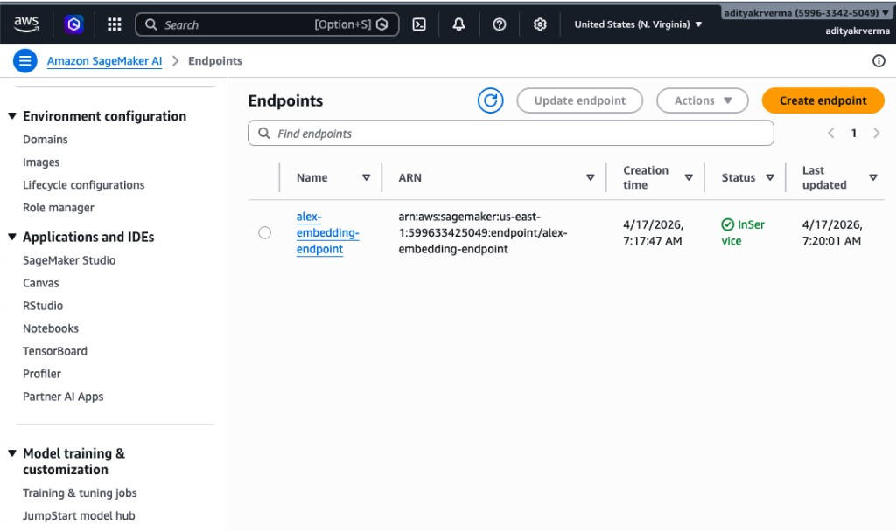

# SageMaker embeddings (Guide 2) — what we build and how Terraform fits in

This document summarizes [Guide 2: SageMaker](../guides/2_sagemaker.md) and how it works together with `terraform/2_sagemaker`. For step-by-step commands and troubleshooting, use the guide.

## What we delivered (Guide 2)

We deployed a **SageMaker serverless endpoint** that generates **embeddings for Alex’s knowledge base**: it turns text into numerical vectors so later components can **search and compare** meaning, not just keywords.

**This deployment includes:**

- A SageMaker **model** that pulls **`sentence-transformers/all-MiniLM-L6-v2`** (same family as `all-MiniLM-L6-v2`) from the **Hugging Face Hub** at runtime—no hand-built model artifact bundle in S3 for this path.
- A **serverless endpoint** that **scales with traffic** and **scales down when idle** (good for course cost; expect cold starts on first calls).
- **Infrastructure as Code** with **Terraform** in `terraform/2_sagemaker` so the role, model, endpoint configuration, and endpoint stay reproducible.

With the Hugging Face container approach, you **do not prepare custom model artifacts**; the container downloads weights from the Hub when the instance starts.

**Deploy (from `terraform/2_sagemaker`):**

```bash
# Initialize Terraform (creates local state file)
terraform init

# Deploy the SageMaker infrastructure
terraform apply
```

The objects those commands create in AWS are spelled out in [How we achieve it (with Terraform)](#how-we-achieve-it-with-terraform) below. After apply, copy outputs into the root **`.env`** (`SAGEMAKER_ENDPOINT=alex-embedding-endpoint`) as described in the guide.

## Technical lens (why embeddings and serverless)

Alex needs **text embeddings** (for this model, **384 floats**) for vector storage and retrieval in later guides. We are **not** training here: a **Hugging Face PyTorch inference image** runs **feature extraction** on JSON you send (for example `backend/vectorize_me.json`). **Serverless** trades occasional **latency spikes** (cold start) for **lower steady cost** than a 24/7 provisioned endpoint.

## How we achieve it (with Terraform)

Terraform turns repeatable configuration into concrete AWS objects in the region you set in `terraform/2_sagemaker/terraform.tfvars` (`aws_region`). A single `terraform apply` in that directory creates this chain:

| Order | Terraform resource | Role |
|------:|----------------------|------|
| 1 | `aws_iam_role` + `AmazonSageMakerFullAccess` | Lets SageMaker assume a role and pull images, create logs, etc. |
| 2 | `aws_sagemaker_model` | Names the model (`alex-embedding-model`), points at the HF container image and sets env vars `HF_MODEL_ID` and `HF_TASK=feature-extraction` so the container knows which model to load. |
| 3 | `aws_sagemaker_endpoint_configuration` | **Serverless** variant: memory and max concurrency for the production variant. |
| 4 | `time_sleep` (15s) | Waits for IAM propagation so endpoint creation does not fail spuriously. |
| 5 | `aws_sagemaker_endpoint` | Live API name **`alex-embedding-endpoint`** that clients call via `sagemaker-runtime:InvokeEndpoint`. |

Outputs (`terraform output`) expose the endpoint name and ARN so you can wire scripts and later Terraform directories consistently.

**Region note:** The default `sagemaker_image_uri` in Terraform is an ECR URI in **us-east-1**. If `aws_region` is something else, align the image URI with [AWS Hugging Face Deep Learning Containers](https://github.com/aws/deep-learning-containers/blob/master/available_images.md) for your region, or keep region and image in the same place the guide expects.

## SageMaker AI in the console

After `terraform apply`, open **Amazon SageMaker AI** in the **same region** as `aws_region` and go to **Inference → Endpoints**. You should see **`alex-embedding-endpoint`** with status **InService** (ready for `InvokeEndpoint`).



The table shows the endpoint **name**, **ARN** (includes account and region), and **status**. That view is the operational “front door” for **online inference** in this project; training jobs, notebooks, and registries live under other left-nav sections but feed the same lifecycle: experiment → train (optional) → register → deploy → invoke.

## SageMaker AI feature map (what the product offers)

SageMaker AI is AWS’s umbrella for **building, training, deploying, and operating** ML. Alex Guide 2 only uses **hosted inference**, but the console sidebar reflects the full platform:

| Area | Examples | Role in typical workflows |
|------|-----------|-----------------------------|
| **Notebooks** | SageMaker Studio, Notebook Instances | Explore data, prototype, call training APIs interactively. |
| **Training & tuning** | Training jobs, hyperparameter tuning, clusters | Fit or fine-tune models; produces model artifacts and metrics. |
| **Inference** | Endpoints (provisioned or serverless), async inference, **Batch Transform** | **Real-time / serverless**: low-latency or elastic online scoring (Alex uses **serverless** here). **Async**: large payloads or long jobs with S3 callback. **Batch Transform**: offline scoring of whole datasets. |
| **Models & registry** | Models list, **Model Registry** | Version and approve models for promotion to endpoints. |
| **Quality & ops** | Model Monitor, Clarify, Debugger | Drift, bias, and performance visibility in production. |
| **Low / no code** | Canvas, JumpStart | Quick experiments or foundation-model solutions without full custom code. |

Alex’s pipeline connection is intentionally narrow for Guide 2: **clients → endpoint → embedding JSON**. Later guides attach those vectors to storage and search; training and notebooks are optional for your own extensions.

## ASCII — Alex embedding path (Terraform + runtime)

```
  App / CLI / Lambda (later guides)
       |
       |  InvokeEndpoint (JSON body)
       v
  SageMaker serverless endpoint  (alex-embedding-endpoint)
       |
       |  HF container + all-MiniLM-L6-v2
       v
  Embedding vector  ------>  Knowledge base / vector index (Guide 3+)
       ^
       |
  Declared by Terraform (model + endpoint config + endpoint)
```

## ASCII diagram — components and data flow

```
  You (student)
       |
       |  terraform init / apply
       v
+------------------ terraform/2_sagemaker -------------------+
|  terraform.tfvars  (aws_region, optional image/model vars) |
|  main.tf, variables.tf, outputs.tf                         |
+--------------------------+---------------------------------+
                           |
                           | creates & wires
                           v
        +--------------------------------------------+
        |              AWS (one region)              |
        |                                            |
        |  IAM role  ----assumed by---->  SageMaker  |
        |                                    |       |
        |                                    v       |
        |                         +----------------+ |
        |                         |  Model         | |
        |                         |  HF container  | |
        |                         |  + HF_MODEL_ID | |
        |                         +--------+-------+ |
        |                                  |         |
        |                                  v         |
        |                         +----------------+ |
        |                         | Endpoint       | |
        |                         | configuration  | |
        |                         | (serverless)   | |
        |                         +--------+-------+ |
        |                                  |         |
        |                                  v         |
        |                         +----------------+ |
        |                         | Endpoint       | |
        |                         | alex-embedding-| |
        |                         | endpoint       | |
        |                         +--------+-------+ |
        +----------------------------------+---------+
                                           |
  aws sagemaker-runtime invoke-endpoint    |  HTTPS API
  (CLI / boto3 / app)                      |
       +-----------------------------------+
       |
       |  request body: JSON text
       v
  Response: JSON with embedding vector (384 dimensions)
```

## ASCII diagram — request lifecycle (conceptual)

```
  Client (AWS CLI, Lambda, local script)
       |
       |  InvokeEndpoint
       |  EndpointName = alex-embedding-endpoint
       |  Content-Type = application/json
       |  Body = {"inputs": "..."}   (shape per HF container contract)
       v
  SageMaker runtime / endpoint
       |
       |  cold start possible: container start, model download from Hub
       v
  Inference container (PyTorch + Transformers)
       |
       |  forward pass -> pooling -> vector
       v
  JSON embedding in response
```

## Quick reference

- **Guide (commands, tests, troubleshooting):** [guides/2_sagemaker.md](../guides/2_sagemaker.md)
- **Terraform module:** `terraform/2_sagemaker/`
- **Test payload example:** `backend/vectorize_me.json`
- **Verify in AWS:** `aws sagemaker describe-endpoint --endpoint-name alex-embedding-endpoint --region <your-region>`

---

## Reference: course order (“order of play”)

### Week 3

- **Week 3 Day 3** — [1_permissions](../guides/1_permissions.md) and [2_sagemaker](../guides/2_sagemaker.md)
- **Week 3 Day 4** — [3_ingest](../guides/3_ingest.md)
- **Week 3 Day 5** — [4_researcher](../guides/4_researcher.md)

### Week 4

- **Week 4 Day 1** — [5_database](../guides/5_database.md)
- **Week 4 Day 2** — [6_agents](../guides/6_agents.md)
- **Week 4 Day 3** — [7_frontend](../guides/7_frontend.md)
- **Week 4 Day 4** — [8_enterprise](../guides/8_enterprise.md)
