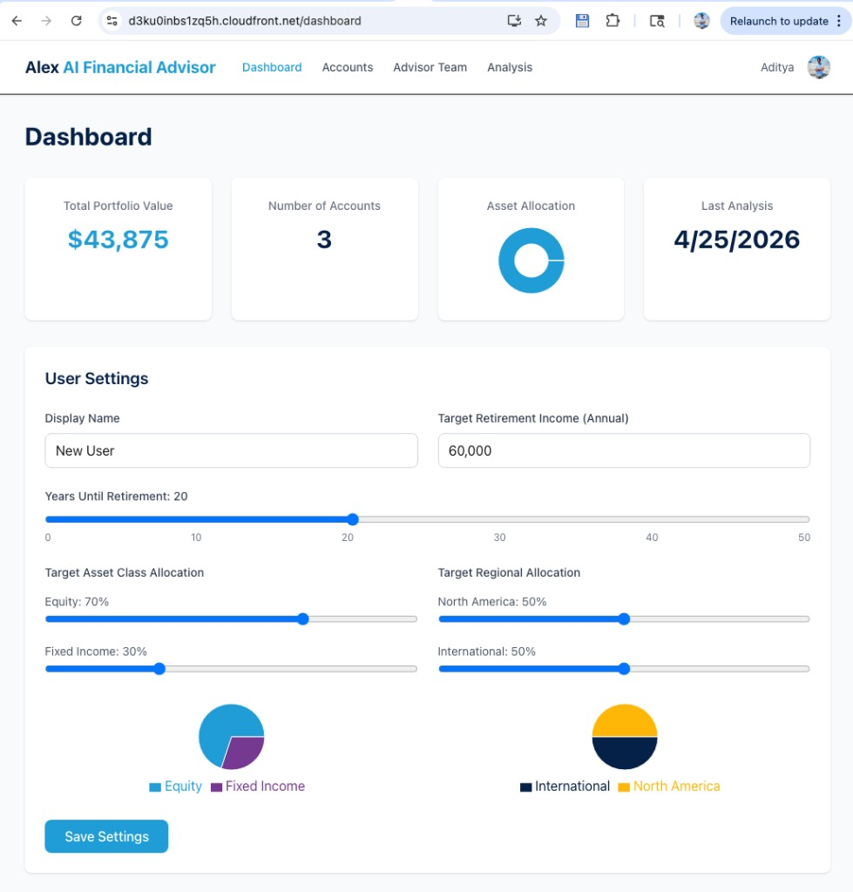
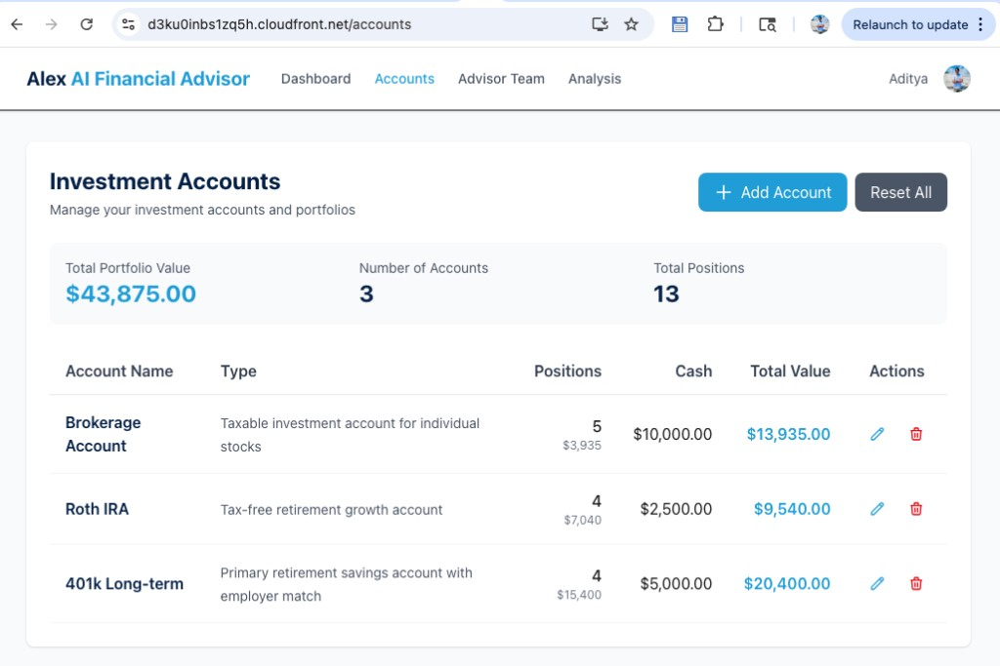
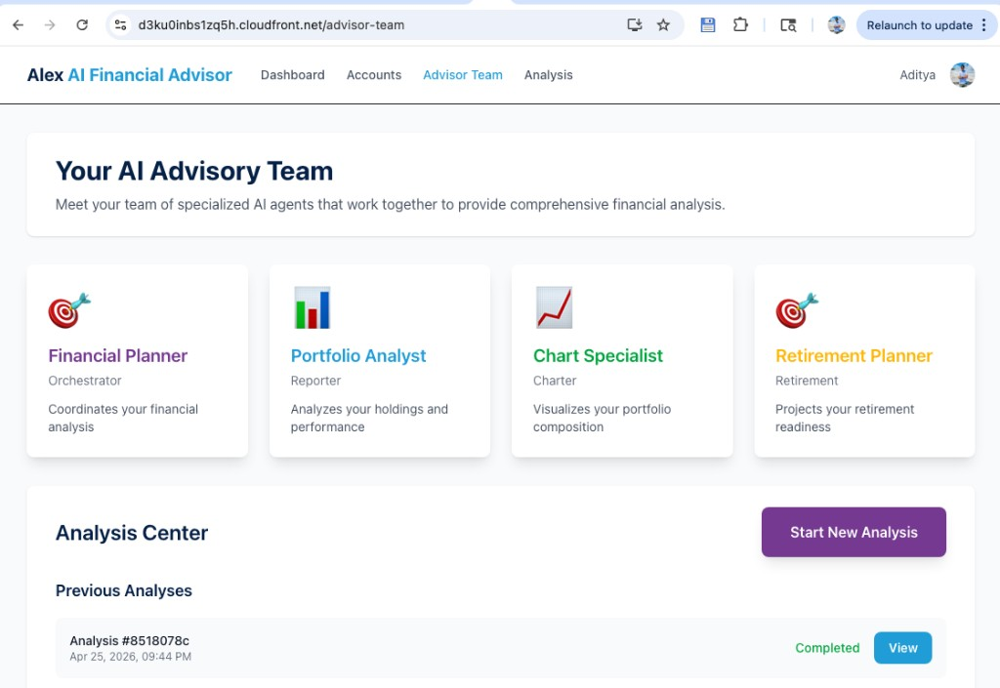
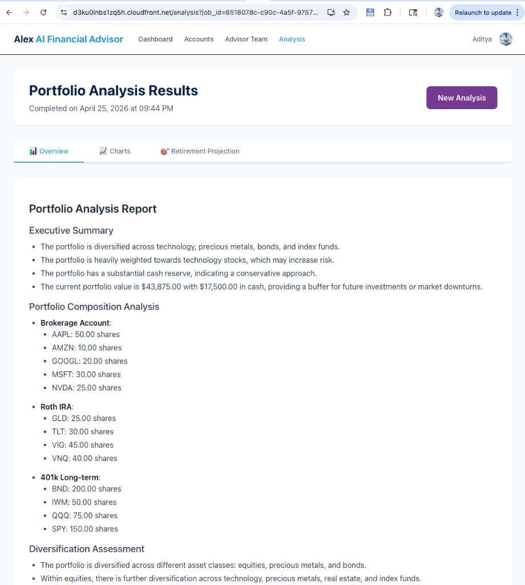
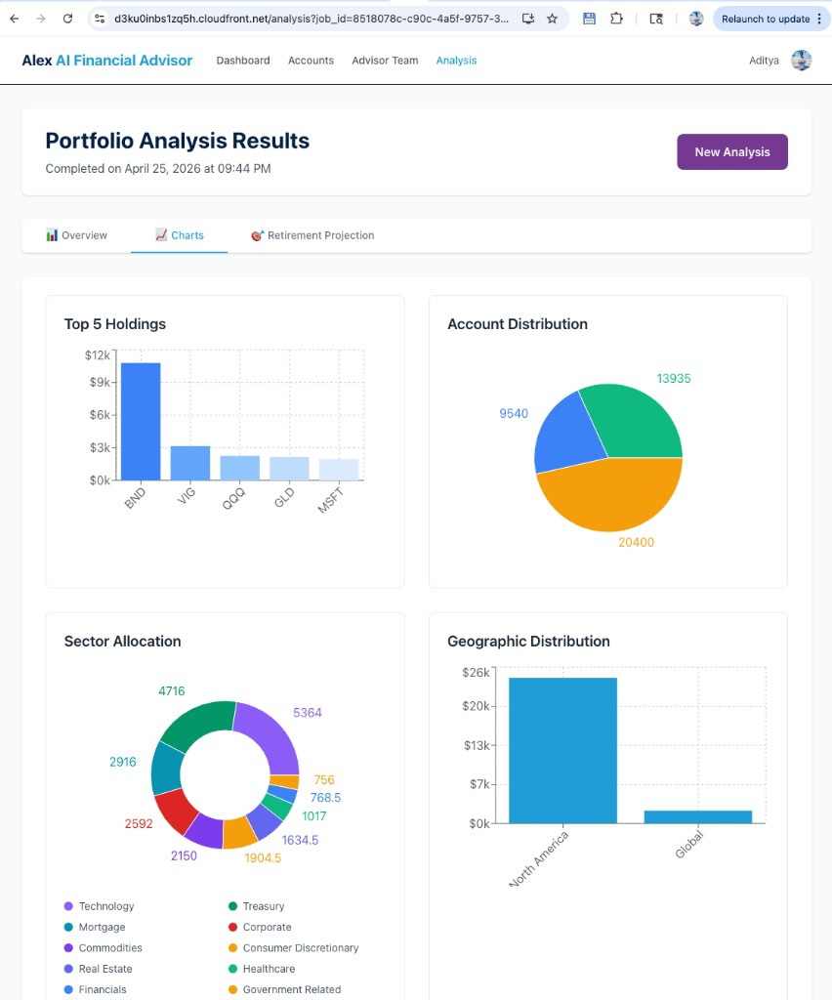
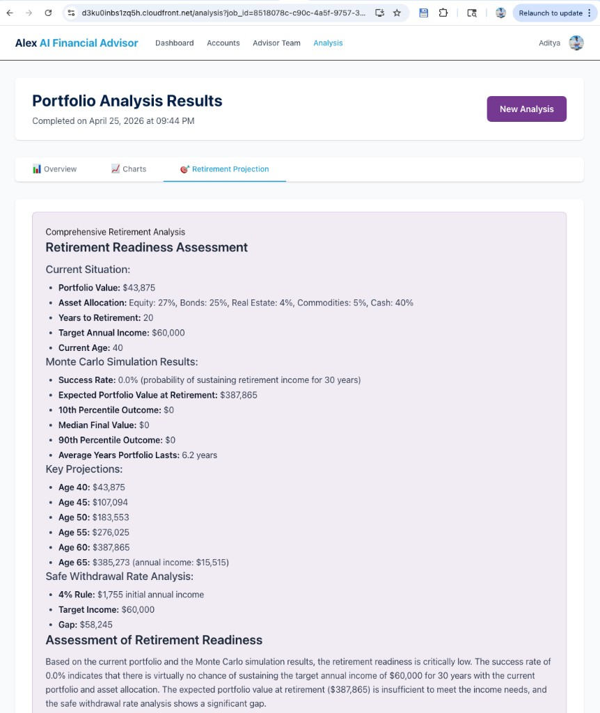
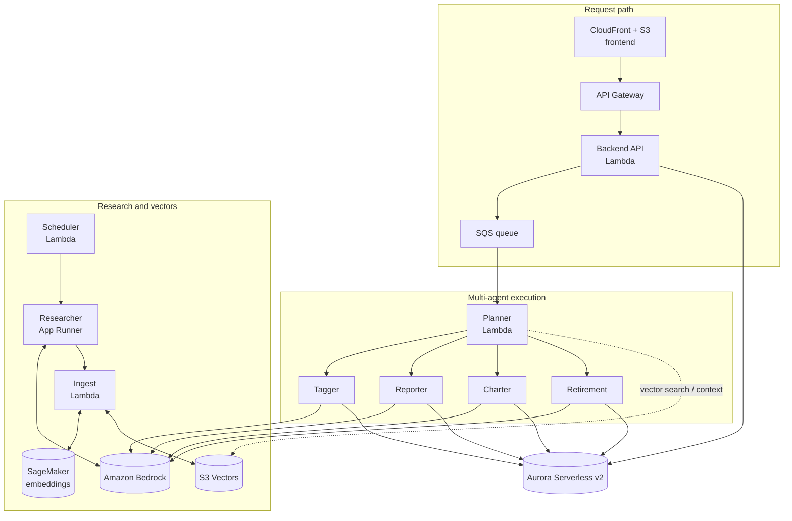
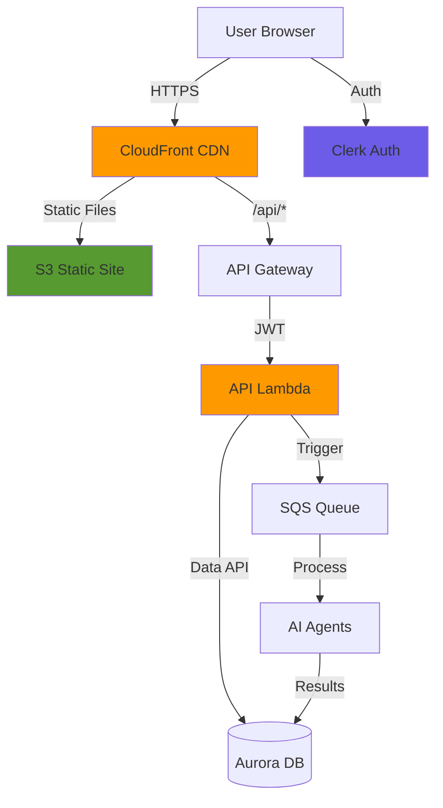

## Database schema map: which table is updated by which service/call

This is a practical “connect the dots” map between the **Aurora tables** (defined in `backend/database/migrations/001_schema.sql`) and the **services / API calls** that write them.

### Tables at a glance

- **`users`**: one row per Clerk user (`clerk_user_id` is the PK)
- **`accounts`**: investment accounts for a user (401k / Roth / taxable, etc.)
- **`positions`**: holdings inside an account (unique per `account_id + symbol`)
- **`instruments`**: reference data for symbols (name/type/prices + allocation JSON)
- **`jobs`**: async analysis jobs + agent outputs (`report_payload`, `charts_payload`, `retirement_payload`, `summary_payload`)

### “Who writes what” (high-signal map)

| Table | Written/updated by | When it happens | Why it exists |
| --- | --- | --- | --- |
| `users` | **`alex-api`** (`GET /api/user`, `PUT /api/user`) | On first sign-in (auto-create), and when user updates preferences | UI needs a DB-backed profile (targets, retirement prefs) tied to Clerk `sub` |
| `accounts` | **`alex-api`** (`GET/POST/PUT/DELETE /api/accounts…`, `POST /api/populate-test-data`, `DELETE /api/reset-accounts`) | CRUD in **Accounts** tab, plus “Populate Test Data” | Portfolio container per user (cash balance, purpose) |
| `positions` | **`alex-api`** (`GET /api/accounts/{id}/positions`, `POST/PUT/DELETE /api/positions…`, `POST /api/populate-test-data`) | CRUD in **Accounts** tab, plus test data | Holdings for analysis + charts (quantity per symbol) |
| `instruments` | **DB seed scripts** (`seed_data.py`) + **`alex-api`** (creates missing symbol on `POST /api/positions`) + **Planner/market updater** (updates `current_price`) + **Tagger** (if run) | Seeded during deploy; may be extended as users add symbols; updated over time for pricing/allocations | Joins to positions for valuations + sector/region allocations; also autocomplete list |
| `jobs` | **`alex-api`** creates job (`POST /api/analyze`) + **Planner** updates status and summary + **Reporter/Charter/Retirement** write payload fields | When user clicks “Start analysis” (Advisor Team); progresses as agents run | Durable job tracking + results store the UI can poll/read |

### What each agent writes (in `jobs`)

The schema intentionally uses **separate JSONB columns** so each agent can write independently:

- **Planner (`alex-planner`)**
  - updates `status`, `started_at`, `completed_at`, `error_message`
  - writes `summary_payload` (final orchestration metadata/summary)
- **Reporter (`alex-reporter`)**
  - writes `report_payload` (markdown + analysis content)
- **Charter (`alex-charter`)**
  - writes `charts_payload` (chart JSON for UI)
- **Retirement (`alex-retirement`)**
  - writes `retirement_payload` (projection results)

### When `alex-api` must access the DB directly (and when it doesn’t)

`alex-api` accesses Aurora directly whenever the UI needs **immediate state**:

- **Dashboard**: user profile + accounts + positions
- **Accounts**: CRUD
- **Analysis**: read job status + results payloads

`alex-api` talks to **SQS** only when the user triggers background work:

- **Advisor Team → Start analysis** (`POST /api/analyze`): create `jobs` row in Aurora, then enqueue SQS message for Planner.


---

## Why does `alex-api` talk to Aurora sometimes, and SQS other times?

It’s two intentionally different paths:

- **Synchronous “CRUD / read-your-data” path (DB only)**: used for pages like **Dashboard**, **Accounts**, and **Analysis** when the UI just needs to **read/write portfolio data or fetch job results**.
- **Asynchronous “run an AI analysis” path (DB + SQS + agent Lambdas)**: used when you click **Start analysis** on **Advisor Team**. That request must return quickly, so it **creates a job in the DB** and then **queues work to SQS** for the Planner/agents to do in the background.

### Path A — synchronous API calls (Aurora via Data API)

Used by endpoints like:
- `GET /api/user`
- `GET /api/accounts`
- `POST /api/accounts`, `POST /api/positions`, etc.
- `GET /api/jobs` / `GET /api/jobs/{job_id}` (read results)

ASCII flow:

```text
Browser UI
  -> CloudFront (/api/*)
  -> API Gateway (HTTP API)
  -> Lambda: alex-api (FastAPI)
  -> Aurora Serverless v2 (RDS Data API)
  <- JSON response
  <- UI renders immediately
```

Why DB is needed here:
- The UI is viewing/editing **stateful data**: users, accounts, positions, jobs, results.
- That data lives in Aurora, so the API must read/write it synchronously.

Screenshots (Network tab) showing the endpoints being called and how they map to AWS:

- **Dashboard**
  - **Browser calls** (typical): `GET /api/user`, `GET /api/accounts` (and positions per account)
  - **AWS path**: CloudFront → API Gateway → **`alex-api` Lambda** → Aurora → JSON back to UI



- **Accounts**
  - **Browser calls** (typical): `GET /api/accounts`, `GET /api/accounts/{account_id}/positions`
  - **Writes** (when you edit): `POST /api/accounts`, `POST /api/positions`, `PUT /api/positions/{id}`, `DELETE /api/positions/{id}`
  - **AWS path**: CloudFront → API Gateway → **`alex-api` Lambda** → Aurora → JSON back to UI



### Path B — start analysis (Aurora + SQS + multi-agent pipeline)

Used by:
- `POST /api/analyze`

ASCII flow:

```text
Browser UI (Start analysis)
  -> CloudFront
  -> API Gateway
  -> Lambda: alex-api
       - write a new Job row to Aurora (status=pending)
       - send SQS message with job_id + clerk_user_id + options
  -> SQS: alex-analysis-jobs
  -> Lambda: alex-planner (triggered by SQS)
       - updates job status in Aurora (running/completed/failed)
       - invokes specialist Lambdas (reporter/charter/retirement[/tagger])
       - specialists write outputs back to Aurora
  <- UI polls GET /api/jobs/{job_id} until completed
  <- UI renders results
```

Screenshots (Network tab) showing the endpoints being called and how they map to AWS:

- **Advisor Team → Start New Analysis**
  - **Browser call**: `POST /api/analyze` (creates a `jobs` row in Aurora, then sends an SQS message)
  - **AWS path**: CloudFront → API Gateway → **`alex-api` Lambda** → Aurora + SQS → **`alex-planner`** (SQS trigger)



- **Analysis → Overview**
  - **Browser call**: `GET /api/jobs/{job_id}` (reads `jobs.*_payload` from Aurora)
  - **AWS path**: CloudFront → API Gateway → **`alex-api` Lambda** → Aurora → returns JSON for UI render



- **Analysis → Charts**
  - **Browser call**: `GET /api/jobs/{job_id}` (reads `charts_payload`)
  - **AWS path**: CloudFront → API Gateway → **`alex-api` Lambda** → Aurora
  - **Who populated it**: **`alex-charter` Lambda** writes `jobs.charts_payload` during analysis



- **Analysis → Retirement Projection**
  - **Browser call**: `GET /api/jobs/{job_id}` (reads `retirement_payload`)
  - **AWS path**: CloudFront → API Gateway → **`alex-api` Lambda** → Aurora
  - **Who populated it**: **`alex-retirement` Lambda** writes `jobs.retirement_payload` during analysis



Why SQS is needed here:
- AI analysis is **long-running** (tens of seconds to minutes) and can involve multiple Lambdas.
- SQS decouples the “user clicked a button” request from the background work, so the UI stays responsive and retries are handled safely.

---

## Database lifecycle: when Aurora gets populated (and by whom)

Aurora is the **system of record** for anything the UI needs to show later: users, accounts, positions, jobs, and agent outputs.

This section ties together **what writes to the DB**, **when it happens**, and **why `alex-api` must access the DB directly** for certain UI tabs.

### Architecture reference (from `README.md`)

This is the “big picture” view (request path + agents + research/vectors):



And here’s the “Guide 7 zoom-in” showing why the API Lambda touches **both** Aurora and SQS:



### 1) DB schema + seed data (one-time “bring the DB to life”)

**Who writes:** `backend/database` scripts (run during deploy step `db-migrate`)

**When:** after `terraform/5_database` creates Aurora (Part 5)

**Why:** Aurora starts empty; we must create tables, indexes, and seed reference data.

- Schema creation: `backend/database/run_migrations.py` (SQL migrations)
- Seed data: `backend/database/seed_data.py` (initial instruments, etc.)

### 2) First time a user signs in (user row is created)

**Who writes:** `alex-api` (`GET /api/user`)

**When:** first visit after Clerk sign-in (Dashboard load does this)

**Why:** the UI needs a DB-backed profile (preferences like targets, years until retirement, etc.) tied to the Clerk `sub`.

### 3) Accounts + positions (UI CRUD)

**Who writes:** `alex-api`

**When:** when you add/edit/delete accounts/positions in the **Accounts** tab or use “Populate Test Data”.

**Why:** this is your portfolio “source of truth” that the analysis and charts operate on.

Examples of DB-writing API actions:
- `POST /api/accounts` (create)
- `POST /api/positions` (create)
- `PUT /api/positions/{id}` (update)
- `DELETE /api/positions/{id}` (delete)
- `POST /api/populate-test-data` (creates accounts + positions + any missing instruments)

### 4) Starting analysis (job row + queue message)

**Who writes:** `alex-api` + SQS

**When:** you click “Start analysis” in **Advisor Team**

**Why:** jobs must be durable and queryable by the UI. SQS ensures long-running work is decoupled from the HTTP request.

`alex-api` does two key things:
- inserts a new job record in Aurora (initial status `pending`)
- sends an SQS message containing `job_id` + `clerk_user_id` + options

### 5) Planner updates job status + orchestrates specialists

**Who writes:** `alex-planner` (and it invokes other Lambdas)

**When:** when SQS triggers Planner

**Why:** the UI needs to see progress and the final results; Planner is the conductor.

Planner writes:
- job status transitions in Aurora (e.g. `pending` → `running` → `completed` / `failed`)

Planner also invokes specialists:
- Reporter (writes narrative report)
- Charter (writes charts JSON)
- Retirement (writes retirement projection output)
- Tagger (only when instrument metadata is missing)

### 6) Specialists write results back to Aurora (so the UI can read them)

**Who writes:** `alex-reporter`, `alex-charter`, `alex-retirement` (and sometimes `alex-tagger`)

**When:** during an analysis run

**Why:** the UI is not “pushed” results; it **pulls** results via `GET /api/jobs/{job_id}`. So results must be stored in Aurora.

### 7) When (and why) `alex-api` accesses Aurora directly

`alex-api` accesses Aurora directly whenever the UI needs **immediate, consistent state**:
- Dashboard: user profile + accounts + positions
- Accounts: CRUD
- Analysis: fetch job status/results

`alex-api` talks to **SQS only** for:
- starting analysis (`POST /api/analyze`) — because the heavy work must happen asynchronously

So yes: **two paths**, but they share the same DB because Aurora is the durable state store for both the UI and the agent pipeline.

