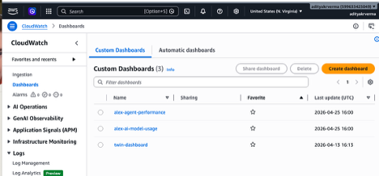
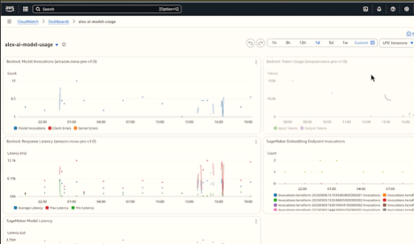
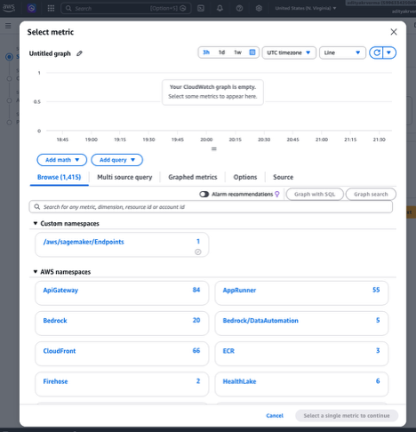
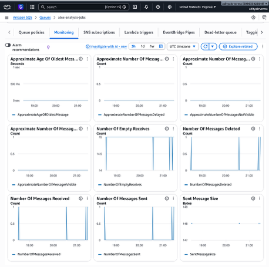
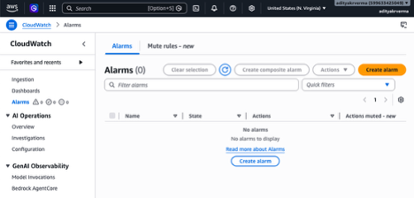
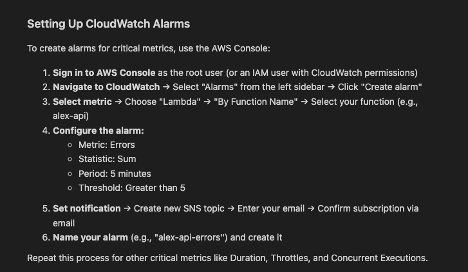

# Monitoring (CloudWatch) — Basics → Dashboards → Alarms (Alex)

This doc explains **monitoring for Alex** using **AWS CloudWatch** (metrics + dashboards + alarms) and how it connects to **logging** (CloudWatch Logs). It is based on **Guide 8, Section 3: Monitoring** (`guides/8_enterprise.md`) and references `docs/08_cloudwatch-logs.md` for deeper, step-by-step log triage.

---

## 1) Monitoring vs logging (clarification)

These are related, but not the same.

- **Logging**: “what happened?” (events, errors, context like `job_id`, stack traces)
  - Stored in **CloudWatch Logs** for Lambdas/App Runner
  - Great for debugging individual failures and understanding control flow

- **Monitoring**: “is the system healthy?” (SLO-ish signals over time)
  - Driven by **metrics** (errors, throttles, latency percentiles, queue depth, DB capacity, model invocations)
  - Visualized as **dashboards**
  - Operationalized via **alarms** (notify when thresholds are crossed)

**In production, you need both**:

- dashboards/alarms tell you **something is wrong**
- logs tell you **why it’s wrong**

---

## 2) What you want to track in Alex (big picture)

Alex is an async, multi-Lambda pipeline:

```text
Frontend -> API Lambda (alex-api) -> Aurora (jobs)
                      |
                      v
                     SQS  -> Planner (alex-planner)
                               |
                               v
                         Specialist Lambdas
                    (tagger/reporter/charter/retirement)
                               |
                               v
                             Aurora (results)
```

So monitoring should answer:

- **API health**: request error rate / latency / throttling
- **Queue health**: backlog, oldest message age, DLQ activity
- **Orchestrator health**: planner errors/throttles/duration
- **Specialists health**: reporter/charter/retirement errors/duration
- **AI cost/perf**: Bedrock invocations, latency, (optionally) spend
- **Dependencies**: SageMaker endpoint latency (embeddings), Aurora capacity/latency

---

## 3) Logging (“Enhanced logging implementation” from Guide 8)

Guide 8 recommends **structured logs** (JSON) so CloudWatch Logs Insights can query them reliably.

### 3.1 API logging (concept)

In the guide, the API (`backend/api/main.py`) logs a structured “ANALYSIS_TRIGGERED” event when `POST /api/analyze` is called, including:

- timestamp
- event_type
- user_id
- details (like accounts/options)

This helps you connect:

**“User clicked Start analysis” → “job_id created” → “SQS message sent”**.

### 3.2 Planner logging (concept)

In the guide’s example for `backend/planner/lambda_handler.py`, you emit events like:

- `PLANNER_STARTED` (with job_id + user_id + timestamp)
- `AGENT_INVOKED` (reporter/charter/retirement)
- `PLANNER_COMPLETED` (duration + status)

This is **logging**, not dashboards—but it makes log triage dramatically faster.

**Where to learn the full end-to-end log triage flow**

- See `docs/08_cloudwatch-logs.md` (it shows how to tail the right log groups and follow one full job run using `job_id`).

---

## 4) Deploying logging changes (Guide 8 workflow)

After you update code, you must re-package and deploy the Lambdas so CloudWatch sees the new log lines.

Guide 8’s commands (as written):

```bash
cd backend
uv run package_docker.py
uv run deploy_all_lambdas.py
```

Then trigger a new analysis from the UI and verify logs.

---

## 5) CloudWatch dashboards (metrics you can “see at a glance”)

Dashboards are for monitoring trends and regressions: “is this system healthy right now?”.

In Alex, dashboards are created via Terraform in `terraform/8_enterprise` (Guide 8).

### 5.1 Dashboard list (what you should see)

This screenshot shows the CloudWatch **Custom Dashboards** list (example names like agent performance / model usage).



**What this tells you:**

- Terraform created dashboards successfully
- You have a single place to monitor the whole system (not just individual Lambdas)

### 5.2 “Model usage” style dashboard (AI monitoring)

This screenshot is an example dashboard showing AI/system-level metrics such as:

- **Bedrock model invocations**
- **Bedrock token usage**
- **Bedrock latency**
- **SageMaker endpoint latency** (embeddings)



**How to interpret it (practically):**

- If the UI feels slow, check whether **Bedrock latency** spiked.
- If costs climb, check whether **invocation rate** increased (traffic, retries, loops).
- If RAG/tool retrieval gets slow, check **SageMaker endpoint latency**.

### 5.3 How dashboards are built (metrics selection)

This screenshot shows CloudWatch’s “Select metric” dialog with namespaces like:

- API Gateway
- Lambda
- SQS
- Bedrock
- SageMaker Endpoints
- CloudFront, App Runner, etc.



**Why this matters:**

- Monitoring is fundamentally “choose the right metrics”
- Dashboards make those metrics visible without digging through consoles

---

## 6) SQS monitoring (the async pipeline’s heartbeat)

SQS is the buffer between the API request and the planner’s multi-agent run. If SQS is unhealthy, users see “pending forever”.

This screenshot shows SQS queue monitoring graphs like:

- Approx age of oldest message
- Approx number of messages visible / delayed / not visible (in-flight)
- Number of messages sent/received/deleted
- Empty receives (polling with no messages)



**How to use it:**

- **Oldest message age rising** ⇒ planner can’t keep up (errors, throttles, low concurrency).
- **Messages visible rising** ⇒ backlog building (same root causes).
- **Not visible rising** ⇒ messages are being processed (in-flight).

### DLQ monitoring (most important “queue alert”)

Guide 8 calls out DLQs: if messages land in the DLQ, the system is failing repeatedly.

Monitoring rule of thumb:

- **DLQ messages > 0** should trigger an alarm + investigation.

---

## 7) CloudWatch alarms (turn dashboards into notifications)

Dashboards are passive; alarms are active.

This screenshot shows the CloudWatch **Alarms** page (no alarms yet).



Guide 8 recommends alarms for:

- Lambda **Errors**
- Lambda **Duration**
- Lambda **Throttles**
- **Concurrent executions**
- SQS/DLQ metrics (especially DLQ)

This screenshot summarizes the “create an alarm” flow:



**Practical alarm set for Alex (good defaults):**

- **API Lambda (`alex-api`)**: Errors > 0 (or > N) for 5m
- **Planner (`alex-planner`)**: Errors > 0 for 5m; Duration p95 too high
- **DLQ**: messages > 0 (immediate)
- **SQS**: oldest message age > X minutes (depending on expected runtime)
- **Bedrock** (optional): latency p95 spikes (detect provider issues)

---

## 8) How monitoring connects to debugging (don’t duplicate—link)

When an alarm fires or a dashboard looks bad, the next step is almost always:

- find the affected **time window**
- grab the **job_id** (if user-facing issue)
- tail the right **log groups** and follow the run across planner + specialists

That workflow is documented in detail here:

- `docs/08_cloudwatch-logs.md`

---

## 9) Cost monitoring (don’t forget)

Guide 8 reminds you that AWS costs can spike unexpectedly with:

- higher traffic
- retry loops / agent loops
- more model/tool invocations

Use:

- AWS Billing budgets/alerts (already set earlier)
- Cost Explorer for service-level breakdown

---

## References

- Guide 8 monitoring section: `guides/8_enterprise.md` (Section 3)
- CloudWatch log triage walkthrough: `docs/08_cloudwatch-logs.md`
- Enterprise overview: `docs/09_PRODUCTION-readiness.md`

