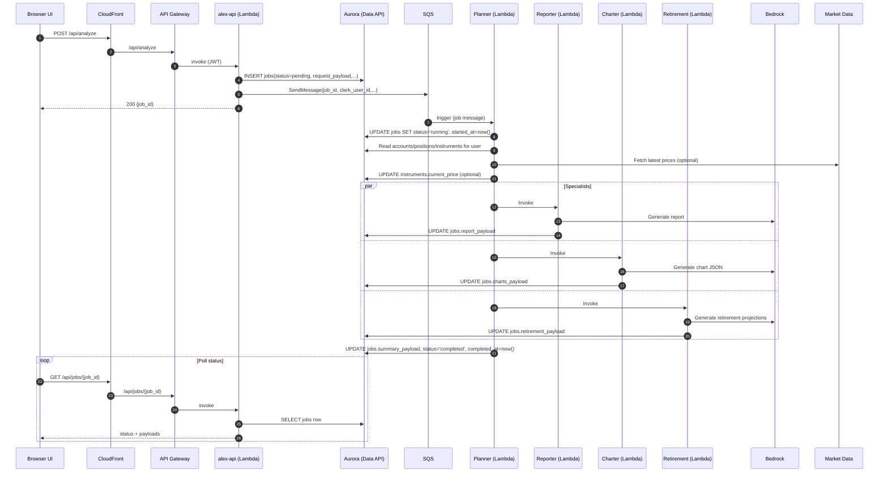

# Smart Financial Advisor (Alex) — System Design (Staff/Principal Interview Prep)

This doc is **staff/principal-level interview preparation material** for designing a **smart financial planning system** (portfolio tracking + AI-driven analysis + charts + retirement projections) based on this project’s architecture.

---

## 1) Problem statement (what we’re building)

Build a system where users can:

- Manage investment accounts + holdings (positions)
- Trigger an AI “advisor team” to analyze their portfolio asynchronously
- View results (report, charts, retirement projection) with strong production qualities: security, monitoring, guardrails, scalability

Key idea: **separate synchronous CRUD** from **asynchronous AI analysis** and use a durable DB row (“job”) as the integration point.

---

## 2) Functional requirements (FR)

- **User & preferences**
  - Sign in (external auth provider)
  - Store user preferences: years-until-retirement, target income, allocation targets

- **Portfolio management**
  - CRUD accounts (401k / Roth / taxable)
  - CRUD positions inside accounts (symbol + quantity; fractional shares supported)
  - Track reference instrument metadata + prices

- **AI analysis (async)**
  - “Start analysis” creates an analysis job and returns quickly
  - A planner/orchestrator triggers specialist workers:
    - Reporter: narrative analysis + recommendations
    - Charter: chart-ready JSON payload
    - Retirement: projection output
    - Tagger: classification/enrichment only when needed
  - UI can poll for job completion and display partial/final results

- **Research/knowledge ingestion (optional but production-relevant)**
  - Periodically research market topics and ingest into vector storage
  - AI agents can retrieve vector context to ground outputs

---

## 3) Non-functional requirements (NFR) (production-ready)

These mirror the “enterprise grade” goals: scalability, security, monitoring, guardrails, explainability, observability.

- **SLOs / SLIs (staff-level: make latency and reliability measurable)**
  - **API read endpoints** (e.g., `GET /api/accounts`, `GET /api/jobs/{id}`):
    - **p50** < 100ms (excluding CDN), **p95** < 300ms, **p99** < 800ms
    - **Availability**: 99.9% monthly (error budget ≈ 43 min/month)
  - **API write endpoints** (e.g., create/update account/position):
    - **p95** < 500ms, **p99** < 1.5s (includes DB write)
  - **Start analysis** (`POST /api/analyze`):
    - **p99** < 1s to return `{job_id}` (async handoff)
  - **Async analysis completion time** (time-to-results):
    - **p50** < 45s, **p95** < 3 min, **p99** < 8 min (depends heavily on LLM + market data)
    - Treat as an internal SLO or “soft SLO” (user-perceived) with explicit UI messaging
  - **Queue health**:
    - Oldest message age p99 < 60s (steady state), DLQ depth = 0 (target)

- **Scalability**
  - Handle variable traffic with bursty spikes
  - Avoid long-running HTTP requests for analysis (async pipeline)
  - Backpressure and retry for job processing

- **Security**
  - Strong authentication (JWT) and per-request authorization
  - Least-privilege IAM for each service
  - Throttling/rate limits to reduce abuse and cost blowups
  - Secrets management (no credentials in code)
  - CORS + XSS protections for frontend/API

- **Reliability**
  - Jobs should be durable and recoverable after failures
  - Failures should be visible and debuggable
  - Dead-letter handling for unrecoverable async failures
  - Clear semantics for partial results vs full failure

- **Observability**
  - Structured logs with job_id/user_id correlation
  - End-to-end traces across multi-agent workflow
  - Dashboards and alarms on key signals

- **Guardrails & correctness**
  - Validate inputs to reduce prompt injection and invalid parameters
  - Validate AI outputs (e.g., chart JSON schema) and degrade safely
  - Bound response sizes and enforce timeouts/retries

- **Cost control**
  - Serverless-first to scale-to-zero where possible
  - Budget alerts + clear destroy/teardown strategy

---

## 4) High-level architecture (north-star diagram)

```mermaid
flowchart TB
  subgraph client["Client"]
    UI[Next.js static site]
    Auth[Clerk Auth]
  end

  subgraph edge["Edge"]
    CF[CloudFront CDN]
  end

  subgraph api_layer["API layer"]
    GW[API Gateway (HTTP API)]
    API[Lambda: alex-api (FastAPI)]
  end

  subgraph state["State + async"]
    AU[(Aurora Serverless v2 Postgres\n(RDS Data API))]
    Q[SQS: analysis-jobs queue]
  end

  subgraph agents["Multi-agent execution (Lambdas)"]
    PL[Planner (orchestrator)]
    TG[Tagger (optional)]
    RP[Reporter]
    CH[Charter]
    RT[Retirement]
  end

  subgraph llm["LLM + market data"]
    BR[(Amazon Bedrock LLM)]
    PX[Market data provider (Polygon)]
  end

  subgraph research["Research + vectors (optional)"]
    SCH[Scheduler Lambda / EventBridge]
    AR[Researcher (App Runner)]
    ING[Ingest Lambda + HTTP API]
    SM[(SageMaker embeddings)]
    VS[(S3 Vectors)]
  end

  UI --> CF
  UI --> Auth

  CF -->|/api/*| GW --> API
  API --> AU
  API -->|Start analysis| Q

  Q --> PL
  PL --> TG
  PL --> RP
  PL --> CH
  PL --> RT

  PL --> AU
  TG --> AU
  RP --> AU
  CH --> AU
  RT --> AU

  PL --> BR
  TG --> BR
  RP --> BR
  CH --> BR
  RT --> BR
  PL --> PX

  SCH --> AR
  AR <--> BR
  AR --> ING
  ING <--> SM
  ING <--> VS
  PL -.->|retrieve context| VS
```

---

## 5) Core data model (schema design)

System of record: **Aurora Postgres**. Auth is external; DB stores the app’s state and AI job outputs.

### 5.1 Tables (what they represent)

From `backend/database/migrations/001_schema.sql`:

- **`users`** (PK = `clerk_user_id`)
  - Preferences: retirement horizon, income goal
  - Target allocations as JSONB
- **`accounts`** (UUID PK)
  - Belongs to a user; cash + account purpose
- **`positions`** (UUID PK)
  - Belongs to an account; (account_id, symbol) unique; fractional shares supported
- **`instruments`** (PK = `symbol`)
  - Reference metadata + current_price + allocation breakdowns as JSONB
- **`jobs`** (UUID PK)
  - Async analysis job tracking + payload columns for each agent’s output

### 5.2 Why JSONB columns for agent outputs?

In `jobs`, each specialist writes to its own JSONB column:

- `report_payload`, `charts_payload`, `retirement_payload`, `summary_payload`

Benefits:

- **No write contention/merging** between agents
- UI reads one row for all results
- Natural evolution of payload shape without frequent schema changes

Tradeoff:

- Harder to query across results (requires JSONB queries / ETL for analytics)

### 5.3 “Who writes what” (ownership model)

- **API (`alex-api`)**
  - Creates user row on first sign-in (`GET /api/user`)
  - CRUD accounts/positions
  - Creates `jobs` row on analysis start (`POST /api/analyze`)
  - Reads job status/results for UI (`GET /api/jobs`, `GET /api/jobs/{job_id}`)
- **Planner + specialists**
  - Update `jobs.status` and write payload columns
  - May update `instruments.current_price` (market refresh)
  - Tagger updates instrument allocation JSON when missing

---

## 6) API design (public HTTP surface)

### 6.1 Authentication & authorization model

- Frontend uses **Clerk**; every API request carries a **JWT**
- API validates JWT using **JWKS** and derives `clerk_user_id` (tenant boundary)
- All DB reads/writes are scoped by `clerk_user_id`

### 6.2 Key endpoints (interview-level)

Synchronous CRUD/read:

- `GET /api/user` (create-if-missing + read user profile)
- `PUT /api/user` (update preferences)
- `GET /api/accounts`
- `POST /api/accounts`, `PUT /api/accounts/{id}`, `DELETE /api/accounts/{id}`
- `GET /api/accounts/{id}/positions`
- `POST /api/positions`, `PUT /api/positions/{id}`, `DELETE /api/positions/{id}`
- `GET /api/jobs` (list)
- `GET /api/jobs/{job_id}` (status + all payloads)

Async analysis trigger:

- `POST /api/analyze`
  - Writes `jobs` row (status=pending)
  - Enqueues `{job_id, clerk_user_id, options}` to SQS
  - Returns `{job_id}` quickly so the UI can poll

Testing/utility (often gated in production):

- `POST /api/populate-test-data`
- `DELETE /api/reset-accounts`

---

## 7) End-to-end flows (explain it like an interview)

### 7.1 Flow A — “Dashboard / Accounts” (synchronous CRUD)

```text
Browser UI
  -> CloudFront (/api/*)
  -> API Gateway (HTTP API)
  -> Lambda: alex-api (FastAPI)
  -> Aurora Serverless v2 (RDS Data API)
  <- JSON response
  <- UI renders immediately
```

Why this is synchronous:

- User expects immediate reads/writes for accounts/positions
- Aurora is the consistent source of truth for portfolio state

### 7.2 Flow B — “Start analysis” (async pipeline + polling)

```text
Browser UI (Start analysis)
  -> CloudFront
  -> API Gateway
  -> Lambda: alex-api
       - insert jobs row (pending)
       - send SQS message (job_id, clerk_user_id, options)
  -> SQS analysis queue
  -> Lambda: Planner (SQS trigger)
       - mark job running
       - refresh prices (market data) as needed
       - optionally invoke Tagger for missing instrument allocations
       - invoke Reporter/Charter/Retirement (parallelizable)
       - specialists write payloads back to jobs row
       - mark job completed/failed
  <- UI polls GET /api/jobs/{job_id} until completed
  <- UI renders report/charts/retirement outputs
```

Why SQS:

- Decouples HTTP request from long-running work
- Provides retries and buffering (backpressure)
- Enables horizontal scale for planners/specialists

### 7.3 Backpressure & rate limiting (how to keep p99 and cost under control)

At staff level, explicitly call out the controls that keep tail latency and spend stable:

- **API Gateway throttles**:
  - Rate-limit per user/IP to protect `alex-api` and Aurora from floods
- **SQS buffering**:
  - Smooths spikes; “queue depth” becomes a first-class scaling signal
- **Reserved concurrency**:
  - Cap concurrency for expensive agent Lambdas to control Bedrock spend
  - Reserve concurrency for `alex-api` to protect CRUD SLOs from analysis bursts

---

## 8) Deep dive: low-level sequence (with ownership + data writes)

### 8.1 Sequence diagram (analysis job)



### 8.2 Failure handling (what happens when something breaks)

- **Planner fails early**: it should write `jobs.status='failed'` + `error_message`; UI stops polling and shows an error state.
- **Specialist fails**: mark job failed or keep partial outputs and record per-agent failure in `summary_payload` (tradeoff; see below).
- **SQS poison message**: configure a **DLQ**; alarm on DLQ depth.

### 8.3 Idempotency & “exactly-once-ish” processing (critical for staff interviews)

SQS + Lambda is **at-least-once**. The design must tolerate duplicates and retries.

- **Idempotency key**:
  - Use `job_id` as the idempotency key across Planner and specialist invocations.
- **Status transitions with compare-and-set semantics**:
  - Treat `jobs.status` transitions as a state machine:
    - `pending -> running -> completed|failed`
  - Planner should only move `pending -> running` once; duplicates should no-op.
- **Specialist writes are upserts by job_id**:
  - Each specialist updates only its own payload column.
  - Re-running a specialist should overwrite the same column deterministically.
- **Message dedupe (optional)**:
  - If strict dedupe is required, consider FIFO SQS with `MessageDeduplicationId=job_id`.
  - Tradeoff: FIFO throughput constraints and operational complexity vs Standard queue simplicity.

---

## 9) How the design satisfies NFRs (explicit mapping)

### 9.1 Scalability

- **Lambda** for API + agents: scales with concurrency
- **SQS**: buffers spikes; enables retries and decoupled compute
- **Aurora Serverless v2**: elastic capacity for DB load
- **API Gateway throttling**: protects backend and cost

### 9.2 Security

- **JWT (Clerk) + JWKS rotation**: validates every request
- **Least-privilege IAM** per Lambda role
- **Secrets Manager** for DB creds
- **CORS allowlist + CSP** for browser protections
- Optional: **WAF**, **GuardDuty**, **VPC endpoints** for higher-security environments

### 9.3 Monitoring & reliability

- **Structured logs** with `job_id` / `user_id`
- **API Gateway access logs** + app logs for request-level tracing
- **CloudWatch dashboards + alarms** for errors/duration/throttles/DLQ depth

Add staff-level signals (tie to SLOs):

- **Latency percentiles (p50/p95/p99)** for:
  - API Gateway integration latency
  - Lambda duration per function
  - Aurora Data API call duration (client-side timing)
- **Queue KPIs**:
  - `ApproximateAgeOfOldestMessage`, `NumberOfMessagesVisible`, DLQ depth
- **Error budget burn alerts**:
  - Alert when 1h / 6h burn rate exceeds thresholds for the 99.9% API SLO

### 9.4 Guardrails, explainability, observability

- **Input validation** (schema validation, prompt-injection sanitation)
- **Output validation** (e.g., chart JSON validation + safe fallback)
- **Retry with exponential backoff** for transient failures
- **Explainability**: rationale fields and audit trails for decisions
- **Observability**: end-to-end traces (e.g., LangFuse + OpenTelemetry instrumentation)

---

## 10) Key design tradeoffs (what to say in an interview)

### 10.1 Async jobs: SQS vs Step Functions

- **Chose SQS + Planner orchestrator**
  - **Pros**: simple, cheap, flexible, high throughput, easy retries
  - **Cons**: orchestration logic is code; harder to visualize; must design idempotency carefully
- **Alternative: Step Functions**
  - **Pros**: explicit workflow state machine, built-in retries/timeouts, better visibility
  - **Cons**: more AWS-specific complexity/cost; more moving parts for a course-scale project

### 10.2 One DB (Aurora) vs polyglot persistence

- **Chose Aurora as system-of-record**
  - **Pros**: strong consistency for portfolio state; relational modeling; joins for valuations
  - **Cons**: can become throughput bottleneck; serverless cold-start characteristics
- **Alternatives**
  - DynamoDB for jobs/status (high write throughput) + Aurora for core portfolio
  - Separate analytics store for reporting/search

### 10.3 JSONB payloads vs normalized tables for agent outputs

- **Chose JSONB in `jobs`**
  - **Pros**: agent outputs evolve quickly; minimal schema churn; easy UI read
  - **Cons**: hard to query; weak constraints; requires validation at write time

### 10.4 Polling vs push updates to UI

- **Chose polling**
  - **Pros**: simple; no websockets; resilient to client disconnects
  - **Cons**: extra read load; slower “real-time” feel
- **Alternative**: WebSocket/API Gateway WebSocket or SSE for live progress

### 10.5 LLM choice (Bedrock)

- **Pros**: managed enterprise LLM access; IAM-based control; regional governance
- **Cons**: model availability differs by region; rate limits; needs strong guardrails for finance outputs

- **Staff-level note**: constrain variance
  - Tail latency and reliability are dominated by LLM calls.
  - Use strict timeouts, bounded retries, and token budgets to keep p99 predictable.

---

## 11) Scaling plan (what changes as usage grows)

### 11.1 Capacity planning (interview-grade, lightweight math)

Define a “unit” of work:

- 1 analysis job triggers ~3 LLM calls (Reporter/Charter/Retirement) + optional Tagger + DB writes.

If peak is \(R\) analysis jobs/minute and average completion is \(T\) minutes, then concurrent in-flight jobs ≈ \(R \times T\).

Use that to reason about:

- **Planner concurrency** required
- **Specialist concurrency** required (and whether to cap it for cost)
- **Aurora write throughput** (jobs row updates + instruments price updates)

- **API scaling**
  - Increase reserved concurrency for `alex-api`
  - Add caching for read-heavy endpoints (CloudFront caching where safe; or Redis)
  - Consider splitting read vs write paths

- **Async pipeline scaling**
  - Increase Planner concurrency; ensure idempotent job processing
  - Consider sharding by user_id/job_id or splitting queues by job_type
  - Introduce Step Functions if orchestration becomes complex

- **DB scaling**
  - Tune Aurora Serverless v2 min/max ACU
  - Add indexes for high-QPS queries (`jobs` by user_id/status)
  - Consider moving “job payload blobs” to S3 and keep pointers in DB for very large outputs

- **Cost controls**
  - Hard request limits / rate limiting
  - Token budgets per user/job; truncate outputs
  - Alarms on spend signals (Bedrock usage patterns, high error retries)

### 11.2 Multi-region and disaster recovery (DR)

Baseline (single-region) is usually acceptable for early stage, but staff-level design should explain the upgrade path:

- **Single region (today)**
  - **Pros**: simplest, lowest latency, lowest ops overhead
  - **Cons**: regional outage impacts all users
- **Active-passive (recommended next step)**
  - Aurora: cross-region read replica or managed DR approach (RPO/RTO defined)
  - Frontend/API: redeploy stacks to secondary region; DNS failover
  - SQS: rebuild queue in secondary region; re-drive jobs as needed
  - **Tradeoff**: async jobs in flight may be lost unless you persist enough state in DB
- **Active-active**
  - Requires careful multi-region consistency, conflict resolution, and global routing.
  - Typically not worth it unless you have strict availability requirements.

---

## 12) Challenges (what’s hard here)

- **Idempotency**: SQS retries can re-run Planner; DB writes must be safe (e.g., status transitions, exactly-once-ish updates).
- **LLM reliability**: hallucinations, invalid JSON, and domain risk (finance) require guardrails.
- **Data correctness**: market data freshness + symbol metadata enrichment, partial coverage.
- **Multi-tenant isolation**: ensure every query is scoped by `clerk_user_id`.
- **Observability across async boundaries**: correlate API request → SQS message → multiple Lambdas.
- **Tail latency (p99)**: dominated by cold starts, DB scaling events, and LLM variability.
- **Correctness vs availability**: decide whether to show partial results or fail the job when one specialist fails.

---

## 13) Open questions (great to ask an interviewer)

- **Regulatory/compliance**: Do we need audit retention, human review, disclaimers, suitability checks?
- **Latency target**: Do we need “near-real-time” progress updates (WebSockets) vs polling OK?
- **Data sources**: What is the required market data quality (EOD vs real-time), and what’s the fallback?
- **Personalization**: Should recommendations be constrained to predefined strategies or fully generative?
- **Storage**: Do we need long-term analytics across jobs (warehouse), and how will we query JSONB payloads?
- **Safety**: What are the explicit forbidden outputs (investment advice boundaries) and how to enforce them?
- **SLOs**: What are the target p99s and availability for CRUD vs analysis? What is acceptable “time to insights”?
- **DR targets**: What are RPO/RTO expectations? Are we allowed to lose in-flight jobs during regional failover?

---

## 14) Interview “walkthrough script” (step-by-step)

1. Start with **FRs** and highlight the two primary user journeys: **CRUD** and **async analysis**.
2. Draw the **north-star diagram** (client/edge/api/db/sqs/agents/llm).
3. Define the **data model** (users/accounts/positions/instruments/jobs) and why `jobs` is the integration point.
4. Explain **Flow A** (CRUD) and **Flow B** (analysis) end-to-end.
5. Map **NFRs → architecture** (security, monitoring, guardrails, scaling).
6. Close with **tradeoffs** and “what I’d change at 10× scale”.

