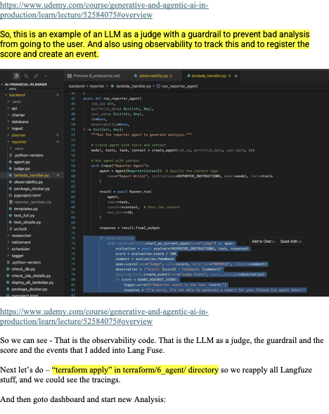
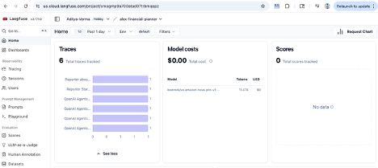
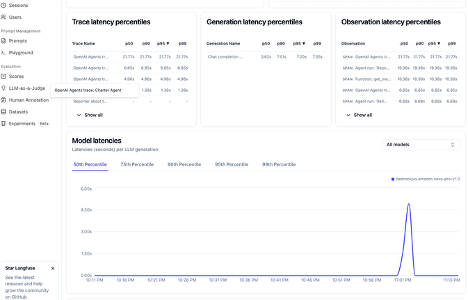
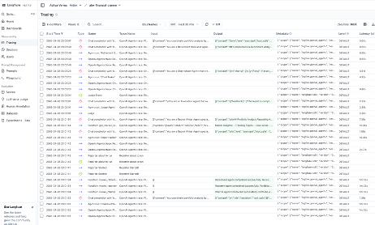
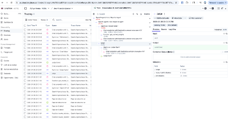

# Observability with Langfuse (Alex / multi-agent)

This doc explains **how Langfuse observability works in this repo**, what you get in the UI (traces, spans, latency, token/cost, scores), and why it’s often more useful than only reading **CloudWatch logs** when debugging a **multi-agent** system.

> Repo context: Alex has an async pipeline (API → SQS → Planner → specialist agent Lambdas). See `docs/08_cloudwatch-logs.md` for the CloudWatch-only debugging view.

---

## 1) What “observability” means here (basics)

For agentic systems, “observability” is more than “did my Lambda print logs?”.

You want to answer questions like:

- **Which agent run produced this output?**
- **Which tool calls happened inside that run?**
- **How long did each step take (planning vs tool call vs model generation)?**
- **What model + settings were used?**
- **What quality score did we assign to the output (if any)?**

Langfuse provides a UI and data model for this:

- **Trace**: one end-to-end run (e.g., “Reporter Agent for job_id=…")
- **Span/Observation**: nested steps inside a trace (e.g., model call, tool call, judge step)
- **Scores**: numeric quality signals attached to spans/traces (e.g., “Judge score”)

---

## 2) Why Langfuse is often better than CloudWatch logs (in multi-agent systems)

CloudWatch logs are great for:

- “Did the Lambda crash?”
- “What exception happened?”
- “What job_id was processed?”
- “What did we print at INFO?”

But in agentic workflows, CloudWatch logs quickly become hard because:

- logs are **split across multiple Lambdas** (planner + reporter + retirement + charter + api)
- you must **manually correlate** by timestamps and `job_id`
- you rarely get a **hierarchical breakdown** of *internal steps*
- model/tool calls are not naturally represented as a nested execution tree

Langfuse helps because it gives you:

- **Hierarchical traces** (one screen shows nested operations)
- **Per-step latency breakdown** (where time is spent)
- **Model usage** (tokens/cost/requests) when instrumented
- **Scores/events** attached to the exact step they refer to (example: “judge” span)

So yes—your intuition is correct: **Langfuse gives finer breakdown than CloudWatch logs**, especially for “what happened inside the agent run”.

**Best practice in production** is to use both:

- **CloudWatch**: infra-level errors, AWS service events, retries, permission failures
- **Langfuse**: agent-level debugging, model/tool traces, quality scoring, regressions

---

## 3) End-to-end flow: where observability happens in Alex

Alex’s analysis pipeline is asynchronous and multi-Lambda:

```text
Browser / Frontend
  -> API Gateway -> API Lambda (alex-api) -> Aurora (creates job)
  -> SQS (job_id message)
  -> Planner Lambda (alex-planner)
       -> invokes specialist Lambdas:
            - Tagger (alex-tagger)   [sometimes]
            - Reporter (alex-reporter)
            - Charter (alex-charter)
            - Retirement (alex-retirement)
       -> specialists write results to Aurora
  -> Frontend polls API -> reads job results
```

**Langfuse is implemented inside each specialist Lambda runtime** (and Planner) via a shared pattern: wrap the handler with `with observe():` so agent traces flush before Lambda exits.

---

## 4) How Langfuse is wired in this repo (code-level flow)

### 3.1 The `observe()` context manager

Both planner and reporter have an `observe()` context manager in an `observability.py` module (example: `backend/planner/observability.py`, `backend/reporter/observability.py`).

Conceptually:

```text
Lambda handler starts
  -> observe() sets up instrumentation (if configured)
  -> your agent code runs (Agents SDK + tools)
  -> observe() flushes traces before Lambda exits (important!)
Lambda ends
```

Key behaviors (from the code):

- It checks env vars (Langfuse configured or not)
- It instruments **OpenAI Agents SDK** via `logfire.instrument_openai_agents()`
- It flushes/shuts down on exit, then waits (sleep) to avoid Lambda terminating before network export completes

### 3.2 Where traces get their names

Inside each Lambda, the agent run is wrapped with the Agents SDK `trace(...)` context manager. That’s what typically becomes the **trace name** you see in Langfuse.

Examples in this repo:

- Planner: `trace("Planner Orchestrator")` in `backend/planner/lambda_handler.py`
- Reporter: `trace("Reporter Agent")` in `backend/reporter/lambda_handler.py`
- Charter: `trace("Charter Agent")` in `backend/charter/lambda_handler.py`
- Retirement: `trace("Retirement Agent")` in `backend/retirement/lambda_handler.py`

### 3.2 Where the “judge” shows up in traces

In `backend/reporter/lambda_handler.py`, after generating the report, it creates a span named `judge` and attaches:

- a **numeric score**
- a **comment/feedback**
- an **event**

That becomes visible in Langfuse as a scored step inside the Reporter trace.

---

## 5) Implementation map (what uses `observe()` today)

All of these Lambdas import `observe()` from their local `observability.py` and wrap the handler:

| Lambda | Handler file | `observe()` usage | `service_name` (Logfire) |
|---|---|---|---|
| Planner | `backend/planner/lambda_handler.py` | `with observe():` | `alex_planner_agent` |
| Reporter | `backend/reporter/lambda_handler.py` | `with observe() as observability:` (creates events/spans/scores) | `alex_reporter_agent` |
| Charter | `backend/charter/lambda_handler.py` | `with observe():` | `alex_charter_agent` |
| Retirement | `backend/retirement/lambda_handler.py` | `with observe() as observability:` (creates events) | `alex_retirement_agent` |
| Tagger | `backend/tagger/lambda_handler.py` | `with observe():` | `alex_tagger_agent` |

**Important nuance:** even when the handler does `with observe():` (no `as observability`), you still get the *automatic* agent traces from `logfire.instrument_openai_agents()`. The `as observability` pattern is only needed when you want to attach **custom events/scores** (like the judge score).

---

## 6) How to check it end-to-end in Langfuse (practical steps)

### 6.1 Confirm Langfuse is enabled (from CloudWatch logs)

When a Lambda runs with Langfuse configured, you should see log lines like:

- `Observability: LANGFUSE_SECRET_KEY exists: True`
- `Observability: OpenAI Agents SDK instrumented`
- `Observability: Setup complete - traces will be sent to LangFuse`
- `Observability: Flushing traces to LangFuse...`

If you see:

- `LangFuse not configured, skipping setup`

then you won’t get traces exported for that run.

### 6.2 Find the right traces in the Langfuse UI

In the Langfuse UI:

- Go to **Traces**
- Filter by time window when you triggered an analysis
- Look for trace names like:
  - **Planner Orchestrator**
  - **Reporter Agent**
  - **Charter Agent**
  - **Retirement Agent**
- Click a trace and inspect the nested spans/observations

### 6.3 Verify the judge score is recorded

In a **Reporter Agent** trace, you should see a span/observation named something like:

- `judge`

Inside it (or attached to it), you should see a **score** and a **comment** coming from `backend/reporter/judge.py`.

---

## 7) Your UI screenshots — step-by-step explanation (in sequence)

Below are your screenshots embedded in the same order you provided, with a quick explanation of what each screen means.

> Note: These images are stored in `docs/assets/` so they render in preview and on GitHub.

---

### Step 1 — The code: where “judge” and observability connect

This screenshot highlights the Reporter flow: generate report → run judge → score span → event → guardrail fallback.



**What’s happening:**

- **Reporter Agent** produces `response`
- `evaluation = await evaluate(...)` calls `backend/reporter/judge.py`
- `score = evaluation.score / 100` normalizes to 0–1 for observability scoring
- `span.score(...)` attaches a **Judge score** and **feedback**
- A **guardrail** blocks low-score reports (replaces output for user safety)

---

### Step 2 — Langfuse Home: traces + model costs + scores (overview)



**What you’re seeing:**

- **Traces**: how many end-to-end runs were recorded (grouped by trace name)
- **Model costs**: aggregate spend/token usage (depends on what’s instrumented/exported)
- **Scores**: aggregated evaluation signals (e.g., judge score), if you’ve recorded them

**How to use this screen:**

- If a user says “analysis looked wrong”, you want to find the trace for that time/job and drill in.
- Over time, this becomes a quality dashboard: “are scores trending down after a change?”

---

### Step 3 — Latency percentiles: where the time goes



**What you’re seeing:**

- **Trace latency percentiles**: end-to-end duration across runs (p50/p90/p99)
- **Generation latency percentiles**: time spent in model generations
- **Observation latency percentiles**: time spent in sub-steps (spans)

**Why this matters more than CloudWatch alone:**

- CloudWatch tells you Lambda duration, but not cleanly: “was it slow due to tool call? model? retries?”
- Langfuse helps you spot: “Reporter is fine, but the `judge` step is slow” or “tool call dominates runtime”.

---

### Step 4 — Traces list: the “table of runs” you drill into



**What you’re seeing:**

- A list of individual trace runs, each with:
  - **name** (often the agent/span name)
  - **time**
  - **latency**
  - often **status**

**How you use it in practice:**

- Filter by time window around a user complaint
- Click a trace to see the nested breakdown (next screenshot)

---

### Step 5 — Trace detail: the nested “execution tree” (agent internals)


**What you’re seeing:**

- Left pane: the full list of traces
- Middle pane: the selected trace’s **nested spans/observations** (tree)
- Right pane: details for the selected span (inputs/outputs/metadata depending on configuration)

**Why this is the “killer feature”:**

- This is the structured breakdown CloudWatch doesn’t naturally give you.
- You can see the internal steps of an agent run as a hierarchy.

---

### Step 6 — Same trace detail view (another example)



**What to look for:**

- A span that corresponds to `judge` (in reporter) or other named spans
- Any span that took unusually long
- Any span whose output looks wrong (prompt, tool payload, response)

---

### Step 7 — Lambda packaging note (why you may see this warning)


This is not Langfuse-specific, but it’s a common point of confusion when deploying:

- `uv` may warn about **nested projects**
- the real deployment blockers are typically Docker not running or missing env vars/permissions

Treat it as informational unless it causes an actual error.

---

### Step 8 — Same packaging warning (duplicate view)


---

## 8) What to instrument next (practical guidance)

To get the most value from Langfuse in an agentic app, you generally want:

- **Stable trace identifiers**: always include `job_id` (and optionally agent name) so you can jump from UI → trace
- **Key spans named by responsibility**: e.g., `planner`, `reporter`, `get_market_insights`, `judge`
- **Scores**: attach quality signals (judge score, schema validation score, etc.)
- **Events**: attach high-level milestones (“Reporter started”, “Judge score low, fallback used”)

In this repo, the “judge score span” is a great start because it turns subjective quality into a measurable signal.

---

## 9) Troubleshooting checklist (when traces don’t show up)

If CloudWatch logs show your Lambda ran but Langfuse is empty:

- **Check env vars**:
  - `LANGFUSE_SECRET_KEY` (required)
  - (and any other Langfuse vars you configured, depending on setup)
- **Confirm the handler uses `with observe():`**
- **Confirm flush happens before Lambda exits**
  - This repo intentionally sleeps after `flush()` because Lambda can terminate too fast.

---

## References in this repo

- **CloudWatch debugging view**: `docs/08_cloudwatch-logs.md`
- **Enterprise checklist (observability section)**: `docs/09_PRODUCTION-readiness.md`
- **Planner Langfuse setup**: `backend/planner/observability.py`
- **Reporter Langfuse setup**: `backend/reporter/observability.py`
- **Judge scoring span**: `backend/reporter/lambda_handler.py`

