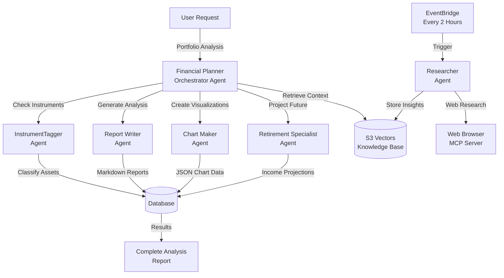
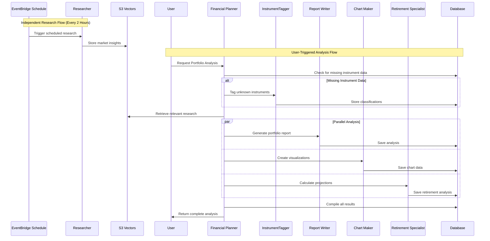
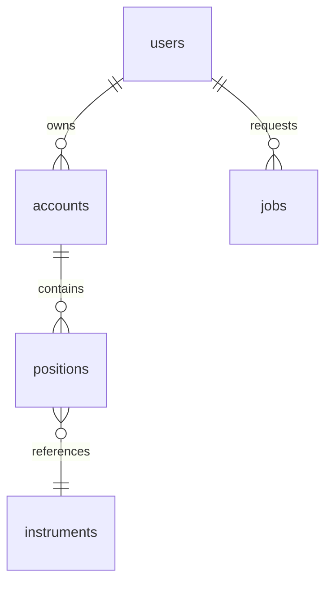
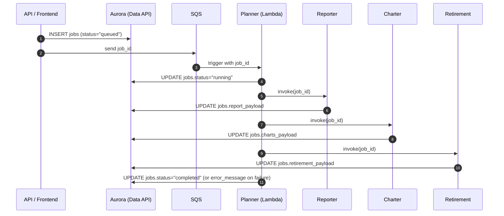

# Alex Multi‑Agent System (Code + AWS Truth)

This doc is a **code-faithful** walkthrough of how Alex’s agents work, what “agent features” they actually use (tools, structured outputs, MCP, state), and how they connect to AWS infrastructure (Lambda, SQS, Aurora Data API, S3 Vectors, SageMaker, Bedrock, App Runner).

The goal is to highlight **what matters to build this system**: event shapes, orchestration, state boundaries, and the few essential SDK patterns that make the agents reliable in production.

---

## Big Picture

Alex has **two related subsystems**:

1. **User-triggered portfolio analysis (multi-agent orchestra)**  
   Runs on **AWS Lambda** and is triggered asynchronously via **SQS**. The **Planner** orchestrates the rest.

2. **Autonomous research (knowledge base builder)**  
   Runs as a **FastAPI service on AWS App Runner**. The **Researcher** uses **Playwright via MCP** to browse the web and then **ingests** results into the **S3 Vectors knowledge base** through the ingestion API.

These meet at **S3 Vectors**: Researcher continuously populates it; Reporter optionally queries it during portfolio report writing.

---

## Architecture Overview (Conceptual, from `guides/agent_architecture.md`)

This is the “how it’s supposed to work” view. The sections below then map it to the **actual code + AWS wiring**.



### Communication flow (Conceptual)



---

## Capability Matrix (updated to match code)

| Agent | Runtime | Trigger | “Agent feature” emphasis | Reads | Writes |
|------|---------|---------|---------------------------|-------|--------|
| Planner | Lambda | SQS | Tools (invoke other Lambdas) | Aurora | jobs.status |
| Tagger | Lambda | Lambda invoke | Structured outputs | Aurora | instruments |
| Reporter | Lambda | Lambda invoke | Tools (RAG via S3 Vectors) | Aurora, SageMaker, S3 Vectors | jobs.report_payload |
| Charter | Lambda | Lambda invoke | Constrained JSON output + parsing | Aurora | jobs.charts_payload |
| Retirement | Lambda | Lambda invoke | Deterministic sim + LLM narrative | Aurora | jobs.retirement_payload |
| Researcher | App Runner | EventBridge / HTTP | MCP + tool | Web, (optional) | S3 Vectors (via ingest) |

---

## Agent Responsibilities (Guide + Reality)

### Planner (Financial Planner / Orchestrator) — `backend/planner`
- **Trigger**: SQS event (`Records[0].body` is job_id)
- **Pre-processing (non-LLM)**:
  - detect missing allocations and invoke Tagger
  - update prices via Polygon into `instruments.current_price`
- **Agent behavior**: an LLM with **3 tools** that invoke other Lambdas
- **Writes**: job `status` (and failure `error_message`)

### Tagger (InstrumentTagger) — `backend/tagger`
- **Input**: `{"instruments":[{"symbol","name"},...]}`
- **Agent feature**: **structured outputs** (Pydantic schema + validators)
- **Writes**: upserts `instruments.*allocation_*` JSONB and basic metadata

### Reporter (Report Writer) — `backend/reporter`
- **Input**: usually `{"job_id": ...}` (loads portfolio/user from Aurora if missing)
- **Agent feature**: tool calling for retrieval (`get_market_insights`)
- **Retrieval path**: SageMaker embed -> S3 Vectors query -> short snippets
- **Writes**: `jobs.report_payload = {"content": "...markdown...", ...}`
- **Extra reliability**: “judge” step; if score too low, emits a safe fallback

### Charter (Chart Maker) — `backend/charter`
- **Input**: usually `{"job_id": ...}` (loads portfolio from Aurora if missing)
- **Agent feature**: “JSON-only” constrained output (then parsed/normalized)
- **Writes**: `jobs.charts_payload` (dict keyed by chart key)

### Retirement (Retirement Specialist) — `backend/retirement`
- **Input**: usually `{"job_id": ...}` (loads portfolio from Aurora if missing)
- **Deterministic core**: Monte Carlo simulation + projections are computed before LLM
- **Writes**: `jobs.retirement_payload = {"analysis": "...markdown...", ...}`

### Researcher (Independent Agent) — `backend/researcher`
- **Runs on**: FastAPI service (App Runner), not part of Part 6 Lambdas
- **Agent features**: **MCP Playwright** + tool (`ingest_financial_document`)
- **Writes**: S3 Vectors (indirectly via the ingest pipeline)

---

## End‑to‑End AWS Flow (Portfolio Analysis)

### High-level ASCII flow

```
User / Frontend / API
        |
        |  (creates a row in `jobs`, then enqueues job id)
        v
   SQS: alex-analysis-jobs
        |
        |  event source mapping (batch_size=1)
        v
Lambda: alex-planner  (timeout 900s, mem 2048MB)
  |
  |-- pre-processing (no LLM):
  |     1) ensure instruments have allocation data  -> invoke alex-tagger (if needed)
  |     2) update instrument prices via Polygon -> updates `instruments.current_price`
  |
  |-- orchestrator agent (LLM with tools):
  |     calls other agents via tools that invoke Lambdas:
  |        - alex-reporter   -> writes jobs.report_payload
  |        - alex-charter    -> writes jobs.charts_payload
  |        - alex-retirement -> writes jobs.retirement_payload
  |
  '-- finalize:
        update jobs.status = completed (or failed on exception)

Aurora Serverless v2 (Data API) is the single shared state store:
  users, accounts, positions, instruments, jobs
```

---

## Terraform Role in AWS Infra Setup

### Part 5: Database (`terraform/5_database`)
- Provisions **Aurora Serverless v2 Postgres** with **Data API enabled** + **Secrets Manager** secret (credentials)
- Outputs the **cluster ARN** + **secret ARN** you must copy into root `.env` as:
  - `AURORA_CLUSTER_ARN=...`
  - `AURORA_SECRET_ARN=...`
- After apply, you initialize schema/data from `backend/database`:
  - `uv run test_data_api.py`
  - `uv run run_migrations.py`
  - `uv run seed_data.py` (and optionally `uv run verify_database.py`)

### Part 6: Agents (`terraform/6_agents`)
### What Terraform actually provisions for Part 6 (`terraform/6_agents`)

```
SQS
  - alex-analysis-jobs (+ DLQ)
  - visibility_timeout_seconds ~= 910s (matches planner timeout)

Lambda functions (zip uploaded to S3 first)
  - alex-planner     (SQS-triggered)
  - alex-tagger
  - alex-reporter
  - alex-charter
  - alex-retirement

IAM role/policy (shared across these Lambdas)
  - CloudWatch Logs
  - SQS receive/delete (planner)
  - lambda:InvokeFunction (planner calling other agents)
  - rds-data:* (Aurora Data API)
  - secretsmanager:GetSecretValue (Aurora secret)
  - s3vectors:QueryVectors/GetVectors + S3 Get/List
  - sagemaker:InvokeEndpoint (embeddings; used by Reporter tool)
  - bedrock:InvokeModel* (wildcard region resource due to inference profile/workarounds)
```

---

## The “Agent Essentials” Used in This Repo

Alex uses the **OpenAI Agents SDK** with **LiteLLM → Bedrock** (`LitellmModel(model=f"bedrock/{model_id}")`).

### 1) Tool calling (function tools)
- Implemented via `@function_tool`.
- Used when an agent needs to **act** (invoke another Lambda, query S3 Vectors, etc.).
- In this codebase:
  - **Planner**: tools = `invoke_reporter`, `invoke_charter`, `invoke_retirement`
  - **Reporter**: tools = `get_market_insights` (SageMaker + S3 Vectors)
  - **Tagger**: **no tools** (uses structured output instead)
  - **Charter**: **no tools** (expects JSON in final output)
  - **Retirement**: **no tools** (simulation + prompt; writes to DB outside the agent)
  - **Researcher**: tool = `ingest_financial_document`

### 2) Structured outputs
- Implemented via `output_type=...` on `Agent(...)` and `result.final_output_as(...)`.
- Used only in **Tagger**, because it needs **validated, schema-safe JSON** (allocations sum to ~100%).

### 3) MCP (Model Context Protocol) servers
- Used only in **Researcher**.
- A Playwright MCP server is started via `MCPServerStdio` running `npx @playwright/mcp@latest ...`.
- This gives the agent **browser automation abilities** (navigate, extract, etc.) in a structured tool-like way.

### 4) “Memory” / state
There is no long-lived chat memory in these Lambdas. “Memory” is implemented as **external state**:

- **Aurora DB**: canonical state for portfolios + job outputs (JSONB columns)
- **S3 Vectors**: long-lived knowledge base for market/research snippets

### 5) Context passing into tools (RunContextWrapper)
- Where tools need request-scoped data, the SDK pattern is used:
  - `Agent[SomeContextType](...)`
  - `Runner.run(..., context=context)`
  - Tools accept `wrapper: RunContextWrapper[SomeContextType]`

Used in:
- Planner (`PlannerContext(job_id=...)`) so tools know which job to operate on.
- Reporter (`ReporterContext(job_id, portfolio_data, user_data, db)`), for the S3 Vectors query tool.

---

## Agent-by-Agent Deep Dive

## 1. Planner (Orchestrator) — `backend/planner`

### Responsibility
- Owns the **workflow** and **coordination**, not the heavy analysis content.
- Ensures prerequisites (instrument metadata, prices) exist before delegating.

### Trigger and input
Triggered by SQS event from `alex-analysis-jobs`.

Accepted job_id sources (code behavior):
```
event.Records[0].body        # common SQS shape
event.job_id                 # direct invoke shape
body may itself be JSON: {"job_id": "..."}
```

### Key steps (exact order in code)

```
run_orchestrator(job_id):
  1) db.jobs.update_status(job_id, "running")
  2) handle_missing_instruments(job_id, db)
       - scans user's positions
       - if instrument missing allocation JSON -> invoke alex-tagger with {"instruments": [...]}
  3) update_instrument_prices(job_id, db)
       - uses Polygon (planner/market.py -> prices.get_share_price)
       - updates instruments.current_price
  4) portfolio_summary = load_portfolio_summary(job_id, db)
       - only counts + totals + retirement settings (keeps prompt small)
  5) create_agent(job_id, portfolio_summary, db)
       - model = Bedrock via LitellmModel
       - tools = invoke_reporter / invoke_charter / invoke_retirement
       - context = PlannerContext(job_id)
  6) Runner.run(...) and wait until "Done"
  7) db.jobs.update_status(job_id, "completed")
```

### “Agent features” used
- **Tool calling**: Yes (invokes other Lambdas)
- **Structured output**: No
- **MCP**: No
- **External state**: DB + downstream agents write to DB

### Important infra connection
- Planner’s tools use `boto3.client("lambda").invoke(...)` to call:
  - `alex-reporter`
  - `alex-charter`
  - `alex-retirement`
- Planner itself is **SQS-triggered** via `aws_lambda_event_source_mapping`.

---

## 2. Tagger (InstrumentTagger) — `backend/tagger`

### Responsibility
Ensures each instrument has **allocation metadata** needed by downstream agents:
- `allocation_asset_class` (JSON)
- `allocation_regions` (JSON)
- `allocation_sectors` (JSON)
Plus an approximate `current_price` (LLM-provided), though Planner later overwrites with Polygon.

### Trigger and input
Direct Lambda invocation (by Planner pre-processing).

Event shape:

```
{
  "instruments": [
    {"symbol": "VTI", "name": "Vanguard Total Stock Market ETF"},
    ...
  ]
}
```

### How it works (code truth)

```
lambda_handler
  -> asyncio.run(process_instruments(instruments))
       -> tag_instruments(instruments)  # LLM classification (structured output)
       -> for each classification:
            - upsert into `instruments` table:
                allocation_asset_class (jsonb)
                allocation_regions (jsonb)
                allocation_sectors (jsonb)
                instrument_type, name, current_price
```

### Structured output (this is the key “agent feature” here)
Tagger is the only agent using **structured outputs**, implemented as:
- `Agent(..., output_type=InstrumentClassification)`
- `result.final_output_as(InstrumentClassification)`

Why this matters:
- Downstream agents (Charter/Retirement/Reporter) assume these allocation JSONs exist.
- Pydantic validators enforce “sums to ~100%” (tolerates small float error).

### “Agent features” used
- **Tool calling**: No
- **Structured output**: **Yes** (Pydantic output type)
- **MCP**: No
- **External state**: writes to Aurora `instruments`

---

## 3. Reporter (Report Writer) — `backend/reporter`

### Responsibility
Produce a **markdown report** for the portfolio, enriched with optional “market context” from **S3 Vectors**.

### Trigger and input
Usually invoked by Planner via Lambda invoke:

```
{"job_id": "<uuid>"}   # portfolio_data/user_data are optional
```

If `portfolio_data` and/or `user_data` are missing, Reporter **loads them from Aurora**:
- finds job → `clerk_user_id`
- loads accounts → positions → instruments

### Tool used: `get_market_insights`
This is the key agent capability here: **tool calling + external retrieval**.

Implementation summary:

```
get_market_insights(symbols):
  1) build query text: "market analysis <symbols...>"
  2) call SageMaker endpoint (sagemaker-runtime.invoke_endpoint) to embed the query
  3) call S3 Vectors (s3vectors.query_vectors) against:
       vectorBucketName = "alex-vectors-<account_id>"
       indexName        = "financial-research"
       topK=3
  4) return short snippets from vector metadata["text"]
```

Notes that matter in AWS:
- The tool uses `DEFAULT_AWS_REGION` for the SageMaker and S3 Vectors clients.
- The S3 Vectors bucket name is derived from STS account id (`alex-vectors-<account_id>`).
- IAM must allow `sagemaker:InvokeEndpoint` and `s3vectors:QueryVectors/GetVectors`.

### LLM execution + persistence boundary
Reporter runs the LLM, then **persists outside the agent**:

```
Runner.run(...) -> response markdown
db.jobs.update_report(job_id, {"content": response, "generated_at": ..., "agent":"reporter"})
```

### Guardrail: judging step
Reporter has an extra reliability layer:
- Calls `judge.evaluate(...)`
- Computes a score, and if it is below `GUARD_AGAINST_SCORE` (~0.3), returns a safe fallback string.

This is not “agent memory”; it’s **quality gating** after generation.

### “Agent features” used
- **Tool calling**: **Yes** (`get_market_insights`)
- **Structured output**: No
- **MCP**: No
- **External state**: reads Aurora + writes `jobs.report_payload`; reads S3 Vectors; calls SageMaker embeddings

---

## 4. Charter (Chart Maker) — `backend/charter`

### Responsibility
Generate 4–6 charts in a Recharts-friendly JSON format and store them into `jobs.charts_payload`.

### Trigger and input
Usually invoked by Planner via:

```
{"job_id": "<uuid>"}  # portfolio_data optional
```

If `portfolio_data` is missing, Charter loads it from Aurora (same pattern as Reporter).

### How it works (important implementation details)

1) Charter pre-computes a **portfolio_analysis** string (totals, holdings, aggregated allocations).  
2) It prompts the model to output **ONLY JSON** with the shape `{ "charts": [ ... ] }`.  
3) It then **parses JSON from the LLM output** by substringing from the first `{` to the last `}`.
4) It converts the list into a dict keyed by `chart["key"]` and stores that dict in the DB.

ASCII of that “LLM → JSON → DB” boundary:

```
LLM final_output (string)
   |
   |  find '{' ... '}' and json.loads(...)
   v
{"charts":[{"key":"asset_allocation",...}, ...]}
   |
   |  normalize
   v
{
  "asset_allocation": {...},
  "geographic_exposure": {...},
  ...
}
   |
   v
db.jobs.update_charts(job_id, charts_payload)
```

### “Agent features” used
- **Tool calling**: No
- **Structured output**: No (it’s “JSON-in-text”, then parsed)
- **MCP**: No
- **External state**: reads Aurora + writes `jobs.charts_payload`

---

## 5. Retirement (Retirement Specialist) — `backend/retirement`

### Responsibility
Generate retirement readiness analysis, using **local simulation** (Monte Carlo) plus LLM explanation.

### Trigger and input
Usually invoked by Planner:

```
{"job_id": "<uuid>"}  # portfolio_data optional
```

If `portfolio_data` is missing, it loads from Aurora.

### What’s “agentic” vs deterministic here
Retirement does **a lot of deterministic computation** before the LLM runs:

```
create_agent(...):
  - compute current portfolio value
  - compute asset allocation fractions
  - run monte carlo (500 sims)
  - generate milestone projections
  - build a rich task prompt with the numbers
  - tools = []  (no tool calling)
```

Then the LLM’s job is mainly:
- interpret the numbers
- explain risks/tradeoffs
- produce recommendations/action plan

Finally it persists outside the agent:
`db.jobs.update_retirement(job_id, {"analysis": result.final_output, ...})`

### “Agent features” used
- **Tool calling**: No
- **Structured output**: No
- **MCP**: No
- **External state**: reads Aurora + writes `jobs.retirement_payload`

---

## 6. Researcher (Autonomous Knowledge Builder) — `backend/researcher` - from week3

### Responsibility
Browse the web, synthesize an “investment research” writeup, and ingest it into the knowledge base.

### Where it runs
Researcher is **not part of the Part 6 Lambda orchestra**. It runs as a **FastAPI service** intended for **AWS App Runner**.

Endpoints:
- `POST /research` (topic optional)
- `GET /research/auto` (for scheduled runs)

### The key “agent feature” here: MCP + tool
Researcher uses:
- `mcp_servers=[playwright_mcp]` for browser automation
- `tools=[ingest_financial_document]` to persist research

ASCII flow:

```
EventBridge Scheduler (or user call)
        |
        v
App Runner: researcher FastAPI
        |
        v
Runner.run(Researcher Agent)
   |         \
   |          \-- MCP: Playwright (browse pages)
   |
   '-- tool: ingest_financial_document(topic, analysis)
            |
            v
        API Gateway ingest endpoint (ALEX_API_ENDPOINT, x-api-key)
            |
            v
        Ingest Lambda (Part 3) -> SageMaker embeddings -> S3 Vectors
```

### Ingest tool details (`ingest_financial_document`)
The tool posts:

```
{
  "text": "<analysis>",
  "metadata": {"topic": "...", "timestamp": "..."}
}
```

To:
- `ALEX_API_ENDPOINT` with header `x-api-key: ALEX_API_KEY`

This is the bridge between autonomous research and the shared knowledge base.

### “Agent features” used
- **Tool calling**: **Yes** (ingest tool)
- **Structured output**: No
- **MCP**: **Yes** (Playwright MCP)
- **External state**: writes to S3 Vectors (via ingest pipeline)

---

## Database (“Memory”) and Job Output Contract — `backend/database`

### What Aurora stores (core tables)

```
users        (Clerk user id + retirement preferences)
accounts     (per-user)
positions    (per-account holdings)
instruments  (reference data + allocations + current_price)
jobs         (async analysis tracking + agent outputs)
```

### Minimal schema diagram (what matters)



### The jobs table is the agent output contract
Each agent writes to its own JSONB column:

```
jobs.report_payload     <- Reporter
jobs.charts_payload     <- Charter
jobs.retirement_payload <- Retirement
jobs.summary_payload    <- Planner (reserved; current code mostly sets status)
```

That design is a big production simplifier:
- No “merge multiple agent outputs” race is required.
- The Planner can coordinate and you always know where each output lives.

### Data API client boundary
Lambdas use **Aurora Data API** (HTTP) via a wrapper (`DataAPIClient`), which avoids VPC connection pooling complexity.

### DB write flow (short, end-to-end)



---

## Bedrock + LiteLLM Region Gotcha (Important)

Across Planner/Reporter/Charter/Retirement/Tagger, Bedrock calls are made through LiteLLM and they set:

```
os.environ["AWS_REGION_NAME"] = BEDROCK_REGION
```

This is the critical env var for LiteLLM’s Bedrock provider.

Terraform sets both:
- `BEDROCK_MODEL_ID` (e.g. `us.amazon.nova-pro-v1:0`)
- `BEDROCK_REGION`   (often `us-west-2`)
- plus `DEFAULT_AWS_REGION` for other AWS calls.

---

## Minimal “How They Connect” Diagram (Everything That Matters)

```
                 (knowledge growth, autonomous)
EventBridge --> App Runner (Researcher)
                  |   \
                  |    \-- MCP: Playwright (web)
                  |
                  \-- tool: ingest_financial_document
                          |
                          v
                API Gateway ingest (x-api-key)
                          |
                          v
                  Ingest Lambda -> SageMaker embed -> S3 Vectors


                (user portfolio analysis, orchestrated)
User/API -> create job row -> SQS job_id
                          |
                          v
                    Lambda: Planner (tools)
                    /      |         \
                   /       |          \
      pre-step: Tagger   invoke      invoke
         (structured)    Reporter    Charter   invoke Retirement
              |            |           |            |
              v            v           v            v
        instruments     jobs.report  jobs.charts  jobs.retirement
              \______________ Aurora Serverless v2 (Data API) _____________/

Reporter tool: get_market_insights
  -> SageMaker embeddings + S3 Vectors query
```

---

## Practical Build Checklist (From This Implementation)

If you’re building/replicating this architecture, the essential moving parts are:

1. **DB contract first**
   - Have `jobs` with one JSONB column per agent output.
   - Make job_id the shared correlation id.

2. **Async orchestration**
   - SQS triggers Planner, Planner invokes other Lambdas.
   - Keep Planner timeout + SQS visibility timeout aligned.

3. **Pick ONE of these per agent**
   - Structured outputs (Tagger)
   - Tool calling (Planner, Reporter, Researcher)
   - Pure “final JSON/text” with parsing/persistence outside the agent (Charter, Retirement)

4. **Long-lived memory is external**
   - Aurora for portfolio + job outputs
   - S3 Vectors for research/market context retrieval

5. **Bedrock via LiteLLM**
   - Set `AWS_REGION_NAME` to your Bedrock region.
