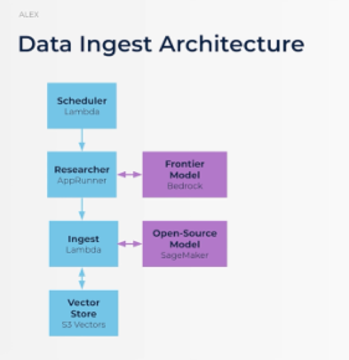
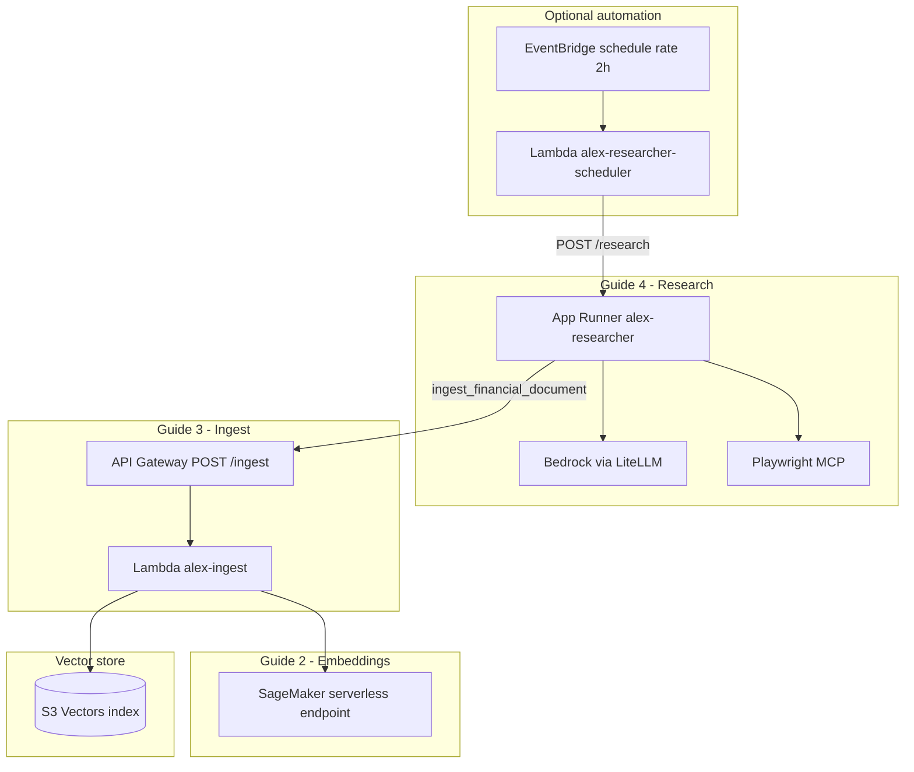

# Alex data pipeline: research → ingest → vectors 

This document ties together **SageMaker embeddings**, the **ingest Lambda**, **S3 Vectors**, and the **Researcher (App Runner)** so you can follow the system end-to-end in the order the course expects. Read **Overall flow** first for the story in plain English; **section 1** is the diagram; **sections 13–14** at the end are the verbose step-by-step reference (deploy + runtime).

## Overall flow (what is going on?)

Six-step mental model of the **automated** path (when the scheduler is on). If the scheduler is off, you still follow steps 3–6 by calling **`POST /research`** yourself or from `test_research.py`.

1. **Scheduler (about every 2 hours)** — Optional **EventBridge** schedule (see `terraform/4_researcher` when `scheduler_enabled = true`) wakes up on a timer so research can run without you.

2. **Scheduler triggers a Lambda** — **`alex-researcher-scheduler`** runs **`backend/scheduler/lambda_function.py`**. EventBridge invokes this small function instead of calling App Runner directly (so a long-running research job is not limited by a short EventBridge HTTP timeout).

3. **Lambda starts the Researcher on App Runner** — That Lambda **POSTs** to your **App Runner** URL **`/research`**, which runs **`backend/researcher/server.py`**: the investment **Researcher agent** starts (with an optional **topic** in the JSON body, or the agent picks one).

4. **Researcher uses a frontier model in Bedrock** — The agent uses **Amazon Bedrock** via LiteLLM (`MODEL` / region in `server.py`), and can use **Playwright MCP** to browse the web for current information before writing conclusions.

5. **Researcher calls Ingest** — When it is time to save to the knowledge base, the agent uses the **`ingest_financial_document`** tool in **`tools.py`**, which **POSTs** to your **API Gateway** **`/ingest`** URL with the **API key** (same contract as a direct `curl` to ingest).

6. **Ingest creates embeddings and stores vectors** — The **`alex-ingest`** Lambda (**`backend/ingest/ingest_s3vectors.py`**) calls **SageMaker** for embeddings, then **S3 Vectors** (`put_vectors`) so the text is searchable later (e.g. with **`test_search_s3vectors.py`**).

---

## 1. Reference diagram (high-level)

The diagram matches this repo: **scheduler (optional) → researcher (Bedrock) → ingest API (Lambda + SageMaker) ↔ S3 Vectors**.



Verbose **one-time** and **runtime** step lists live at the end in **sections 13–14** (reference).

---

## 2. What to deploy first (strict sequence)

The numbered **one-time steps** are in **section 13**; the table below is the same order in compact form.

Think of **three independent Terraform stacks** plus **two application folders** that depend on them.

| Step | Guide | What you get | Primary directories |
| --- | --- | --- | --- |
| A | [1_permissions.md](../guides/1_permissions.md) | IAM access for your user | (console / policies) |
| B | [2_sagemaker.md](../guides/2_sagemaker.md) | Serverless **embedding** endpoint (`all-MiniLM-L6-v2`, 384 dims) | `terraform/2_sagemaker/` |
| C | [3_ingest.md](../guides/3_ingest.md) | **Ingest** Lambda + API Gateway + bucket wired to SageMaker + S3 Vectors API | `terraform/3_ingestion/`, `backend/ingest/` |
| D | [4_researcher.md](../guides/4_researcher.md) | **Researcher** on App Runner + ECR; optional EventBridge → scheduler Lambda | `terraform/4_researcher/`, `backend/researcher/`, `backend/scheduler/` |

**Dependency rule:** Part 3 needs the SageMaker **endpoint name** from Part 2. Part 4 needs the **ingest API URL and API key** from Part 3 so the researcher can call ingest.

---

## 3. End-to-end ASCII map

Section 3 shows the **same pipeline twice**: **3.1** is a compact high-level flow (good for recall); **3.2** is the detailed ASCII map with resource names, file paths, and payload hints.

### 3.1 High-level flow

Quick mental model: optional schedule → researcher → secured ingest API → embed → vector store.

```
[EventBridge every 2h]  (optional)
         |
         v
  Lambda backend/scheduler/lambda_function.py
         |  POST https://<app-runner>/research
         v
+---------------------------+
| App Runner                |  backend/researcher/server.py
| Bedrock (LiteLLM)         |  + mcp_servers.py (Playwright)
| Tool -> tools.py          |
+---------------------------+
         |  POST { text, metadata } + x-api-key
         v
+---------------------------+
| API Gateway /ingest       |  terraform/3_ingestion/main.tf
+---------------------------+
         v
+---------------------------+
| Lambda alex-ingest        |  backend/ingest/ingest_s3vectors.py
+---------------------------+
    |              |
    v              v
 SageMaker      S3 Vectors
 (Guide 2)      (Guide 3 bucket + index)
```

### 3.2 Detailed map (same pipeline, more labels)

```
  [Optional] EventBridge Scheduler (rate 2h)
           |
           v
  Lambda: alex-researcher-scheduler  (backend/scheduler/lambda_function.py)
           |  POST https://<app-runner>/research  (empty JSON -> agent picks topic)
           v
+-------------------------------------------------------------+
|  AWS App Runner: alex-researcher                            |
|  backend/researcher/server.py (FastAPI)                     |
|    - Bedrock via LiteLLM (REGION/MODEL in server.py)        |
|    - Playwright MCP (backend/researcher/mcp_servers.py)     |
|    - Tool: ingest_financial_document (backend/researcher/   |
|            tools.py) -> HTTP POST + x-api-key               |
+-------------------------------------------------------------+
           |
           |  HTTPS JSON: { "text": "<analysis>", "metadata": {...} }
           v
+-------------------------------------------------------------+
|  API Gateway (prod) POST /ingest  + API key                 |
|       -> Lambda: alex-ingest                                |
|  backend/ingest/ingest_s3vectors.py::lambda_handler         |
|    1) SageMaker invoke_endpoint (embeddings)                |
|    2) s3vectors.put_vectors (store vector + metadata)       |
+-------------------------------------------------------------+
           ^
           |  same bucket / index for semantic search
           |
  S3 Vectors index (default name in code: financial-research)
  Bucket: alex-vectors-<account_id> (from terraform/3_ingestion)
```

**Local / manual testing** (no scheduler): you call App Runner `POST /research` (see `backend/researcher/test_research.py`) or call API Gateway `POST .../ingest` with `curl`.

---

## 4. Detailed vertical flow (numbered)

Same runtime path as **section 14**, shown here as compact arrows.

```
1) Human or test script
      -> POST https://<service-url>/research {"topic": "..."}   [optional topic]

2) App Runner: run_research_agent()
      -> LiteLLM + Bedrock (frontier model)
      -> MCP: browser fetch (Playwright)
      -> Agent may call tool ingest_financial_document(topic, analysis)

3) tools.ingest_financial_document
      -> POST ALEX_API_ENDPOINT with header x-api-key: ALEX_API_KEY
      -> Body matches Lambda contract: { "text", "metadata" }

4) API Gateway validates API key -> invokes Lambda alex-ingest

5) ingest_s3vectors.lambda_handler
      -> get_embedding(text) via SageMaker runtime client
      -> s3_vectors.put_vectors(...) with float32 embedding + metadata

6) Knowledge base
      -> Vectors + metadata in S3 Vectors; searchable with same embedding model
         (local scripts: backend/ingest/test_search_s3vectors.py)
```

---

## 5. “Ingest path” only (infrastructure + code)

### 5.1 Responsibility

**Turn arbitrary text into a vector and persist it** so later queries can use semantic search.

### 5.2 Block diagram (ingest)

```
                    +------------------+
  Client ---------->| API Gateway      |
  (API key)         | POST /ingest     |
                    +--------+---------+
                             |
                             v
                    +-------------------+
                    | Lambda alex-ingest|
                    | ingest_s3vectors  |
                    +--------+----------+
                             |
              +--------------+---------------+
              |                              |
              v                              v
     +----------------+            +-------------------+
     | SageMaker       |           | S3 Vectors API    |
     | embedding EP    |           | put_vectors       |
     | (Part 2)        |           | (Part 3 bucket)   |
     +----------------+            +-------------------+
```

### 5.3 Key files (ingest)

| Path | Role |
| --- | --- |
| `backend/ingest/ingest_s3vectors.py` | Lambda handler: parse JSON, embed, `put_vectors` |
| `backend/ingest/search_s3vectors.py` | Packaged alongside ingest; **search** handler (not wired to API Gateway in default `main.tf`; used for packaging / future or manual wiring) |
| `backend/ingest/package.py` | Builds `lambda_function.zip` for Terraform |
| `backend/ingest/test_ingest_s3vectors.py` | Direct boto3 ingest tests (local dev) |
| `backend/ingest/test_search_s3vectors.py` | Query vectors after research |
| `terraform/3_ingestion/main.tf` | Bucket, Lambda role/policy, `aws_lambda_function.ingest`, REST API + key |
| `terraform/3_ingestion/variables.tf` | `aws_region`, `sagemaker_endpoint_name` |
| `terraform/3_ingestion/outputs.tf` | `ALEX_API_ENDPOINT`, `VECTOR_BUCKET`, API key id |

### 5.4 Terraform ↔ Python contract

- **Lambda handler:** `ingest_s3vectors.lambda_handler` (set in `terraform/3_ingestion/main.tf`).
- **Environment variables** on Lambda: `VECTOR_BUCKET`, `SAGEMAKER_ENDPOINT` (index name defaults in code to `financial-research` via `INDEX_NAME` in `ingest_s3vectors.py`).
- **IAM:** Lambda may `sagemaker:InvokeEndpoint` on your endpoint and `s3vectors:*` on `bucket/.../index/*`.

---

## 6. “Research path” only (agent + optional automation)

### 6.1 Responsibility

**Use a frontier LLM (Bedrock) plus optional web browsing** to produce investment-style text, then **push summaries into the ingest pipeline** so they become searchable vectors.

### 6.2 Block diagram (research)

```
  +------------------+       +-------------------+
  | Scheduler Lambda |------>| App Runner        |
  | (optional)       | POST  | FastAPI /research |
  +------------------+       +---------+---------+
                                       |
                    +------------------+------------------+
                    |                                     |
                    v                                     v
            +---------------+                    +----------------+
            | Bedrock       |                    | Playwright MCP |
            | (LiteLLM)     |                    | (browse web)   |
            +---------------+                    +----------------+
                    |
                    v
            +---------------------------------+
            | Agent tool: ingest_financial_   |
            | document -> API Gateway ingest  |
            +---------------------------------+
```

### 6.3 Key files (research)

| Path | Role |
| --- | --- |
| `backend/researcher/server.py` | FastAPI app: `/research`, `/research/auto`, `/health`; configures `REGION` / `MODEL` for LiteLLM + Bedrock |
| `backend/researcher/tools.py` | `ingest_financial_document`: HTTP client to `ALEX_API_*` |
| `backend/researcher/mcp_servers.py` | Playwright MCP stdio server for the agent |
| `backend/researcher/context.py` | Prompt / instruction text for the agent |
| `backend/researcher/deploy.py` | Docker build/push to ECR + optional App Runner update |
| `backend/researcher/Dockerfile` | Container for App Runner |
| `backend/researcher/test_research.py` | End-to-end smoke test against deployed service |
| `terraform/4_researcher/main.tf` | ECR, App Runner service, instance role (Bedrock), optional scheduler |
| `backend/scheduler/lambda_function.py` | Scheduled trigger: `POST https://<APP_RUNNER_URL>/research` |

**Runtime secrets:** Terraform injects `OPENAI_API_KEY`, `ALEX_API_ENDPOINT`, `ALEX_API_KEY` into App Runner from `terraform/4_researcher/terraform.tfvars` (see variables in that directory).

### 6.4 Scheduler detail (code vs guide wording)

- **Terraform** creates `aws_lambda_function.scheduler_lambda` named **`alex-researcher-scheduler`** when `scheduler_enabled = true`.
- The Lambda **POSTs to `/research`** with an empty JSON body (`backend/scheduler/lambda_function.py`), which matches `ResearchRequest.topic = None` and behaves like “agent picks a topic” (similar intent to `/research/auto` in `server.py`).

---

## 7. SageMaker (Guide 2) in one glance

```
terraform/2_sagemaker/main.tf
  -> IAM role for SageMaker
  -> aws_sagemaker_model (HF image + all-MiniLM-L6-v2)
  -> serverless endpoint configuration
  -> aws_sagemaker_endpoint  (default name: alex-embedding-endpoint)
```

That endpoint is **only** for **384-dimensional embeddings**. It is invoked by:

- the **ingest Lambda** (production path), and  
- local scripts under `backend/ingest/` when you test directly.

---

## 8. How Terraform and application code connect

```
terraform/2_sagemaker          backend/ (no Lambda here)
        |                              |
        | output: endpoint name        | aws CLI / scripts use SAGEMAKER_ENDPOINT
        v                              v
terraform/3_ingestion  <--- variable: sagemaker_endpoint_name
        |                              |
        | env: SAGEMAKER_ENDPOINT       | backend/ingest/ingest_s3vectors.py
        | env: VECTOR_BUCKET            |
        v                              v
   API Gateway URL + API key  ----->  .env ALEX_API_*  ----->  terraform/4_researcher
                                              |                    (var.alex_api_*)
                                              v
                                      App Runner env vars
                                              |
                                              v
                               backend/researcher/tools.py (httpx POST)
```

---

## 9. Mermaid (interactive mental model)



---

## 10. Practical “where do I look?” checklist

| If you want to understand… | Open these |
| --- | --- |
| Embedding math / SageMaker IO | `backend/ingest/ingest_s3vectors.py` (`get_embedding`), `guides/2_sagemaker.md` |
| Public ingest API + IAM | `terraform/3_ingestion/main.tf`, `guides/3_ingest.md` |
| How research lands in the KB | `backend/researcher/tools.py` → `backend/ingest/ingest_s3vectors.py` |
| Model + region for Bedrock | `backend/researcher/server.py` (student overrides), `guides/4_researcher.md` |
| Docker / deploy flow | `backend/researcher/deploy.py`, `backend/researcher/Dockerfile`, `terraform/4_researcher/main.tf` |
| Scheduled runs | `terraform/4_researcher/main.tf` (`scheduler_enabled`), `backend/scheduler/lambda_function.py` |
| Search / cleanup locally | `backend/ingest/test_search_s3vectors.py`, `backend/ingest/cleanup_s3vectors.py` |

---

## 11. Notes that reduce confusion

1. **Guide 3 text vs Terraform:** The written guide still describes creating a “vector bucket” in the S3 console in some revisions; **this repo’s `terraform/3_ingestion/main.tf` creates an `aws_s3_bucket` named `alex-vectors-<account_id>`** and wires IAM for the `s3vectors` control plane. You still need an **index** that matches `INDEX_NAME` in code (default **`financial-research`**, dimension **384**)—create it in the AWS console or CLI if it is not already present.
2. **`search_s3vectors.py`** is included in the Lambda zip by `package.py` but the sample **API Gateway** in `terraform/3_ingestion/main.tf` only exposes **`/ingest`**. Semantic search in the guides is often exercised via **local scripts** hitting AWS APIs.
3. **Bedrock region vs App Runner region:** App Runner runs in your chosen `aws_region`; LiteLLM/Bedrock calls use the region you set in `server.py` (students often align with model availability, e.g. Nova in `us-east-1` or OSS models in `us-west-2` per guide comments).

---

## 12. Related guides (read in order)

1. [1_permissions.md](../guides/1_permissions.md)  
2. [2_sagemaker.md](../guides/2_sagemaker.md)  
3. [3_ingest.md](../guides/3_ingest.md)  
4. [4_researcher.md](../guides/4_researcher.md)  
5. [5_database.md](../guides/5_database.md) (next phase: Aurora; different data plane from this pipeline)

---

## 13. Reference: one-time steps (build, deploy, configure)

Do these in order so every runtime hop has ARNs, keys, and models in place. (Same story as **section 2** in more detail.)

1. **Guide 1 — Permissions**  
   Complete [1_permissions.md](../guides/1_permissions.md) so your IAM user can use SageMaker, Lambda, S3 / S3 Vectors, API Gateway, Bedrock, ECR, and App Runner as required by later guides.

2. **Guide 2 — Embedding endpoint** (`terraform/2_sagemaker`)  
   Copy `terraform.tfvars.example` → `terraform.tfvars`, run `terraform init` / `terraform apply`. Record the endpoint name (default **`alex-embedding-endpoint`**) in root **`.env`** as **`SAGEMAKER_ENDPOINT`**.

3. **S3 Vectors index (outside default Terraform)**  
   Ensure a vector **index** exists that matches code: **`INDEX_NAME`** default **`financial-research`**, dimension **384**, distance **cosine** (see `backend/ingest/ingest_s3vectors.py`). Terraform in **`terraform/3_ingestion`** creates the **bucket** `alex-vectors-<account_id>`; the index is still created in AWS (console or CLI) unless you add automation elsewhere.

4. **Guide 3 — Ingest API + Lambda** (`backend/ingest`, `terraform/3_ingestion`)  
   `cd backend/ingest && uv run package.py` → produces **`lambda_function.zip`**. In **`terraform/3_ingestion`**, set **`sagemaker_endpoint_name`** from step 2, then `terraform apply`. Copy **`VECTOR_BUCKET`**, **`ALEX_API_ENDPOINT`**, **`ALEX_API_KEY`** from `terraform output` into root **`.env`**.

5. **Guide 4 — Researcher on App Runner** (`backend/researcher`, `terraform/4_researcher`)  
   Put **`OPENAI_API_KEY`**, **`ALEX_API_ENDPOINT`**, **`ALEX_API_KEY`** in **`.env`** and the same ingest URL/key into **`terraform/4_researcher/terraform.tfvars`**. Follow [4_researcher.md](../guides/4_researcher.md): apply ECR + IAM first if you use `-target`, then **`uv run deploy.py`** from **`backend/researcher`**, then full **`terraform apply`** for App Runner. Edit **`REGION`** and **`MODEL`** in **`backend/researcher/server.py`** for Bedrock access you actually have.

6. **Optional — Scheduled research**  
   In **`terraform/4_researcher/terraform.tfvars`**, set **`scheduler_enabled = true`**. Ensure **`backend/scheduler/lambda_function.zip`** exists (Terraform references it when the scheduler is enabled), then **`terraform apply`**. EventBridge invokes **`alex-researcher-scheduler`**, which calls App Runner **`POST /research`**.

---

## 14. Reference: runtime steps (research → stored vector)

Each step is one logical hand-off for a **single** knowledge-base write (the path your code implements). (Same story as **section 4** in prose form.)

1. **Trigger** — A client calls **`POST https://<app-runner-service>/research`** with optional JSON **`{"topic": "..."}`**, or the optional **scheduler Lambda** (`backend/scheduler/lambda_function.py`) POSTs **`/research`** with **`{}`** so the agent picks a topic.

2. **Research service** — **`backend/researcher/server.py`** runs **`run_research_agent`**: sets **`AWS_REGION_NAME`** (and related) for LiteLLM, builds **`LitellmModel(MODEL)`** → **Amazon Bedrock**, attaches **Playwright MCP** (`mcp_servers.py`) and the **`ingest_financial_document`** tool from **`tools.py`**.

3. **Agent execution** — **OpenAI Agents** `Runner.run` (max turns per `server.py`) lets the model use MCP browsing, then call **`ingest_financial_document(topic, analysis)`** when it decides to persist analysis text.

4. **Authenticated HTTP ingest** — **`ingest_financial_document`** POSTs to **`ALEX_API_ENDPOINT`** with **`x-api-key: ALEX_API_KEY`** and body **`{ "text": "<analysis>", "metadata": { "topic", "timestamp", ... } }`** (retries in **`tools.py`** handle cold starts).

5. **API Gateway → Lambda** — API Gateway validates the key and invokes **`alex-ingest`** with **`ingest_s3vectors.lambda_handler`**.

6. **Embedding** — Lambda **`get_embedding`** calls **SageMaker** **`invoke_endpoint`** using env **`SAGEMAKER_ENDPOINT`**, parses the nested JSON response into a single vector.

7. **Vector store** — Lambda calls **`s3vectors.put_vectors`** on **`VECTOR_BUCKET`** / **`INDEX_NAME`**, storing **`float32`** embedding plus **metadata** (including full **`text`** for later retrieval).

8. **Search (separate operation)** — Query text is embedded with the **same** SageMaker endpoint, then **`s3vectors.query_vectors`** runs against the same bucket/index (e.g. **`backend/ingest/test_search_s3vectors.py`**). The default **`terraform/3_ingestion`** API exposes **`POST /ingest`** only, not search.

---

*Document generated for the Alex / AI in Production capstone. It reflects the repository layout and Terraform as of the date it was written; always verify resource names in your own `terraform output` and AWS console.*
